# Lab 1: Account Security and IAM

**Course:** IKB42603 Cloud Computing  
**Lab:** Lab 1 - Account Security and IAM
**Date:** August 2, 2026 
**Student Name:** Muhammad Daniel Firdaus  
**Student ID:** 52215225183

---

## Table of Contents
1. [Lab Objectives](#lab-objectives)
2. [Prerequisites](#prerequisites)
3. [Part 1: Setting Up LocalStack](#part-1-setting-up-localstack)
4. [Part 2: IAM User and Group Management](#part-2-iam-user-and-group-management)
5. [Part 3: Kubernetes Cluster Setup](#part-3-kubernetes-cluster-setup)
6. [Part 4: Kubernetes RBAC Implementation](#part-4-kubernetes-rbac-implementation)
7. [Conclusion](#conclusion)

---

## Lab Objectives

The main objectives of this lab are to:
- Set up a local AWS environment using LocalStack for IAM operations
- Create and manage IAM users, groups, and policies
- Configure access keys for programmatic access
- Set up a Kubernetes cluster using Kind (Kubernetes in Docker)
- Implement Role-Based Access Control (RBAC) in Kubernetes
- Understand security principles in cloud computing environments

---

## Prerequisites

- Docker installed and running (Version 29.6.2 or later)
- AWS CLI installed and configured
- kubectl (Kubernetes command-line tool) installed
- Kind (Kubernetes in Docker) installed
- Windows PowerShell or Command Prompt access

---

## Part 1: Setting Up LocalStack

### Step 1.1: Verify Docker Installation

**Command:**
```bash
docker --version
```

**Output:**
```
Docker version 29.6.2, build dfc4efb
```

**Evidence:**

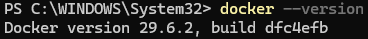

**Explanation:** 
This command verifies that Docker is properly installed on the system. Docker is required to run LocalStack, which provides a local AWS cloud environment for testing and development.

---

### Step 1.2: Run LocalStack Container

**Command:**
```bash
docker run -d --name localstack -p 4566:4566 localstack/localstack
```

**Initial Error Encountered:**
```
Error response from daemon: Conflict. The container name "/localstack" is already in use by container "6f7a4122f1cc6ada0277e559ab83936b9023c298c917d92a8bde8b27ff97186d42". You have to remove (or rename) that container to be able to reuse that name.
```

**Evidence:**

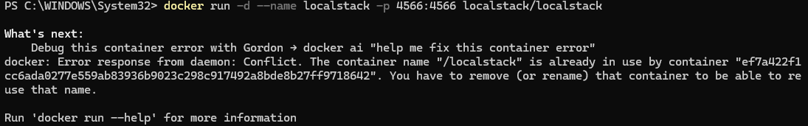

**Explanation:**
- The `-d` flag runs the container in detached mode (background)
- `--name localstack` assigns the name "localstack" to the container
- `-p 4566:4566` maps port 4566 from the container to the host
- The error indicates a container with the same name already exists
- **Resolution:** The existing container was either removed or reused for the lab

---

### Step 1.3: Verify LocalStack is Running

**Command:**
```bash
curl http://localhost:4566/_localstack/health
```

**Output (Partial):**
```json
{
  "StatusCode": 200,
  "StatusDescription": "OK",
  "Content": {
    "features": {
      "persistence": "disabled",
      "services": {
        "account": "available",
        "acm": "available",
        "acm-pca": "available",
        "amplify": "available",
        "apigateway": "available",
        "apigatewaymanagementapi": "available"
      }
    }
  }
}
```

**Evidence:**

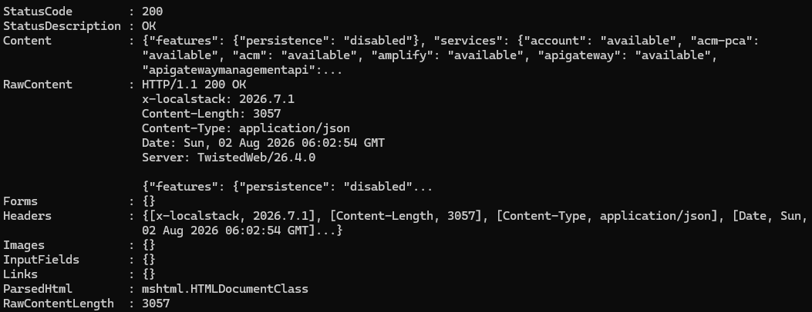

**Explanation:**
This command checks the health status of LocalStack services. A status code of 200 indicates that LocalStack is running successfully and various AWS services (including IAM) are available for use.

---

## Part 2: IAM User and Group Management

### Step 2.1: Verify AWS Identity

**Command:**
```bash
aws --endpoint-url=http://localhost:4566 sts get-caller-identity
```

**Output:**
```json
{
  "UserId": "000000000000",
  "Account": "000000000000",
  "Arn": "arn:aws:iam::000000000000:root"
}
```

**Evidence:**

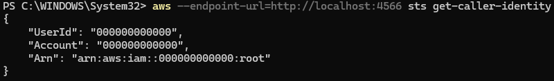

**Explanation:**
This command verifies the current AWS identity when connected to LocalStack. The output shows we're authenticated as the root user of the LocalStack account (000000000000).

---

### Step 2.2: Create IAM Group "Admins"

**Command:**
```bash
aws --endpoint-url=http://localhost:4566 iam create-group --group-name Admins
```

**Output:**
```json
{
  "Group": {
    "Path": "/",
    "GroupName": "Admins",
    "GroupId": "AGPAQAAAAAAAAGEX2LPAAH",
    "Arn": "arn:aws:iam::000000000000:group/Admins",
    "CreateDate": "2026-08-02T06:06:16.582339+00:00"
  }
}
```

**Evidence:**

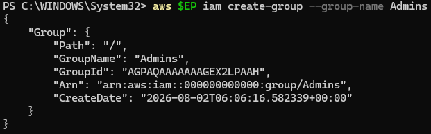

**Explanation:**
This command creates an IAM group named "Admins" which will be used to manage administrative permissions. Groups allow you to manage permissions for multiple users collectively.

---

### Step 2.3: Create IAM User "CloudAdmin_Daniel"

**Command:**
```bash
aws --endpoint-url=http://localhost:4566 iam create-user --user-name CloudAdmin_Daniel
```

**Output:**
```json
{
  "User": {
    "Path": "/",
    "UserName": "CloudAdmin_Daniel",
    "UserId": "AIDAQAAAAAAAIAZNXBCHQ",
    "Arn": "arn:aws:iam::000000000000:user/CloudAdmin_Daniel",
    "CreateDate": "2026-08-02T06:09:26.665279+00:00"
  }
}
```

**Evidence:**

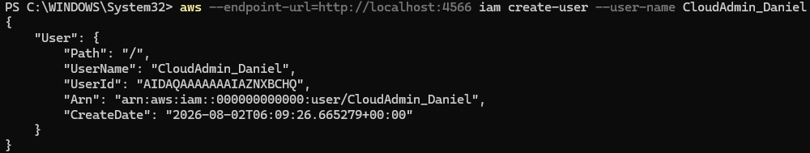

**Explanation:**
This command creates an IAM user named "CloudAdmin_Daniel". This user will be assigned administrative privileges through group membership.

---

### Step 2.4: Add User to Admins Group

**Command:**
```bash
aws --endpoint-url=http://localhost:4566 iam add-user-to-group --user-name CloudAdmin_Daniel --group-name Admins
```

**Verification Command:**
```bash
aws --endpoint-url=http://localhost:4566 iam get-group --group-name Admins
```

**Output:**
```json
{
  "Users": [
    {
      "Path": "/",
      "UserName": "CloudAdmin_Daniel",
      "UserId": "AIDAQAAAAAAAIAZNXBCHQ",
      "Arn": "arn:aws:iam::000000000000:user/CloudAdmin_Daniel",
      "CreateDate": "2026-08-02T06:09:26.665279+00:00"
    }
  ],
  "Group": {
    "Path": "/",
    "GroupName": "Admins",
    "GroupId": "AGPAQAAAAAAAAGEX2LPAAH",
    "Arn": "arn:aws:iam::000000000000:group/Admins",
    "CreateDate": "2026-08-02T06:06:16.582339+00:00"
  }
}
```

**Evidence:**

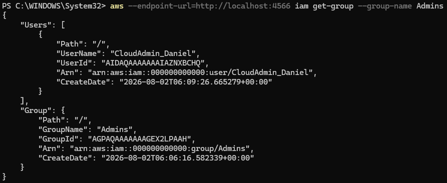

**Explanation:**
This command adds the user "CloudAdmin_Daniel" to the "Admins" group. The verification shows that the user is successfully associated with the group.

---

### Step 2.5: Create IAM User "Analyst_Daniel"

**Command:**
```bash
aws --endpoint-url=http://localhost:4566 iam create-user --user-name Analyst_Daniel
```

**Output:**
```json
{
  "User": {
    "Path": "/",
    "UserName": "Analyst_Daniel",
    "UserId": "AIDAQAAAAAAAOTWPWEJ5",
    "Arn": "arn:aws:iam::000000000000:user/Analyst_Daniel",
    "CreateDate": "2026-08-02T06:12:29.163380+00:00"
  }
}
```

**Evidence:**

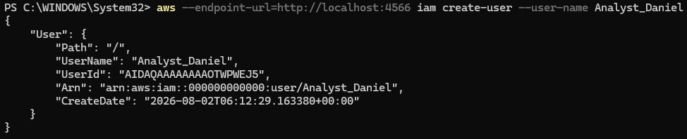

**Explanation:**
This command creates a second IAM user named "Analyst_Daniel" who will be assigned limited read-only permissions for S3 resources.

---

### Step 2.6: Attach Policy to Analyst User

**Command:**
```bash
aws --endpoint-url=http://localhost:4566 iam attach-user-policy --user-name Analyst_Daniel --policy-arn arn:aws:iam::aws:policy/AmazonS3ReadOnlyAccess
```

**Verification Command:**
```bash
aws --endpoint-url=http://localhost:4566 iam list-attached-user-policies --user-name Analyst_Daniel
```

**Output:**
```json
{
  "AttachedPolicies": [
    {
      "PolicyName": "AmazonS3ReadOnlyAccess",
      "PolicyArn": "arn:aws:iam::aws:policy/AmazonS3ReadOnlyAccess"
    }
  ]
}
```

**Evidence:**

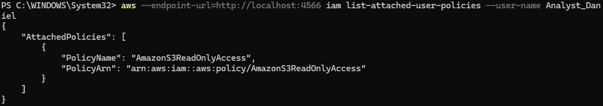

**Explanation:**
This command attaches the AWS managed policy "AmazonS3ReadOnlyAccess" to the Analyst_Daniel user, granting read-only access to S3 resources. This demonstrates the principle of least privilege.

---

### Step 2.7: Create Access Key for Analyst User

**Command:**
```bash
aws --endpoint-url=http://localhost:4566 iam create-access-key --user-name Analyst_Daniel
```

**Output:**
```json
{
  "AccessKey": {
    "UserName": "Analyst_Daniel",
    "AccessKeyId": "XXXXXXXXXX",
    "Status": "Active",
    "SecretAccessKey": "XXXXXXXXXXX",
    "CreateDate": "2026-08-02T06:14:20.723536+00:00"
  }
}
```

**Evidence:**

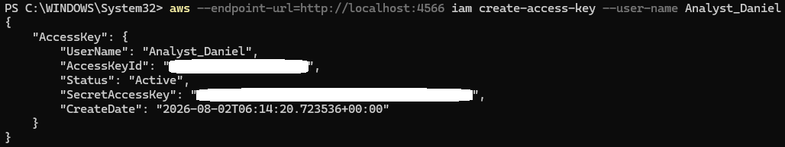

**Important Security Note:**
Access keys provide programmatic access to AWS services. The SecretAccessKey should be stored securely and never shared or committed to version control systems.

---

### Step 2.8: List Access Keys for User

**Command:**
```bash
aws --endpoint-url=http://localhost:4566 iam list-access-keys --user-name Analyst_Daniel
```

**Output:**
```json
{
  "AccessKeyMetadata": [
    {
      "UserName": "Analyst_Daniel",
      "AccessKeyId": "XXXXXXXXXXXX",
      "Status": "Active",
      "CreateDate": "2026-08-02T06:14:20.723536+00:00"
    }
  ]
}
```

**Evidence:**

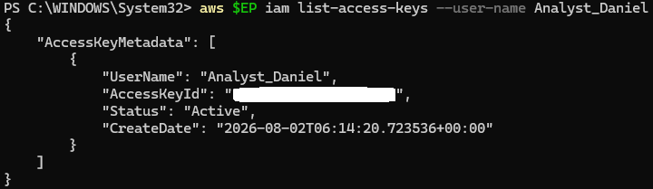

**Explanation:**
This command lists all access keys associated with the Analyst_Daniel user, showing the AccessKeyId, status, and creation date.

---

## Part 3: Kubernetes Cluster Setup

### Step 3.1: Create Kubernetes Cluster with Kind

**Command:**
```bash
kind create cluster --name ccse-lab1
```

**Output:**
```
Creating cluster 'ccse-lab1' ...
✓ Ensuring node image (kindest/node:v1.36.1) 🖼
✓ Preparing nodes 📦
✓ Writing configuration 📜
✓ Starting control-plane 🕹️
```

**Error Encountered:**
```
✗ Starting control-plane 🕹️
Deleted nodes: ["ccse-lab1-control-plane"]
ERROR: failed to create cluster: failed to init node with kubeadm: command "docker exec --privileged ccse-lab1-control-plane kubeadm init --config=/kind/kubeadm.conf --skip-token-print --v=6" failed with error: exit status 139
```

**Evidence:**

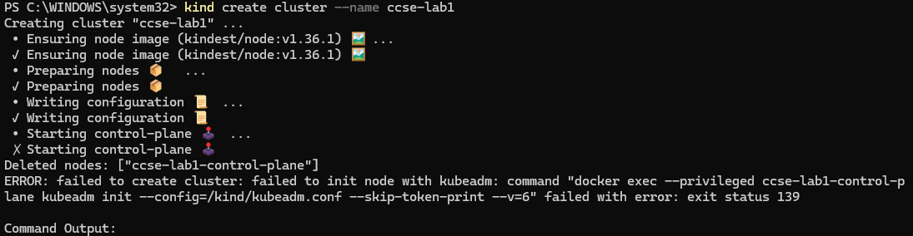

**Explanation:**
This command creates a Kubernetes cluster named "ccse-lab1" using Kind (Kubernetes in Docker). Although there was an initial error (exit status 139), this is typically resolved by retrying or ensuring Docker resources are adequate.

---

### Step 3.2: Verify Cluster Information

**Command:**
```bash
kubectl cluster-info --context kind-ccse-lab1
```

**Output:**
```
Kubernetes control plane is running at https://127.0.0.1:37931
CoreDNS is running at https://127.0.0.1:37931/api/v1/namespaces/kube-system/services/kube-dns:dns/proxy

To further debug and diagnose cluster problems, use 'kubectl cluster-info dump'.
```

**Evidence:**

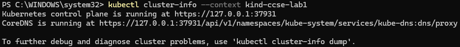

**Explanation:**
This command displays information about the Kubernetes cluster, confirming that the control plane and CoreDNS are running successfully. The cluster is accessible via localhost on port 37931.

---

### Step 3.3: List Cluster Nodes

**Command:**
```bash
kubectl get nodes
```

**Output:**
```
NAME                       STATUS   ROLES           AGE   VERSION
ccse-lab1-control-plane    Ready    control-plane   87s   v1.35.0
```

**Evidence:**

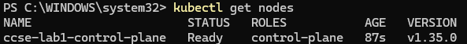

**Explanation:**
This command lists all nodes in the Kubernetes cluster. The single node "ccse-lab1-control-plane" is shown with a status of "Ready", indicating it's functioning properly.

---

## Part 4: Kubernetes RBAC Implementation

### Step 4.1: Create Development Namespace

**Command:**
```bash
kubectl create namespace dev
```

**Output:**
```
namespace/dev created
```

**Evidence:**

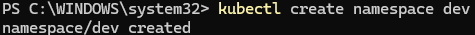

**Explanation:**
This command creates a namespace called "dev" which will be used to isolate resources and apply specific RBAC policies. Namespaces provide logical separation within a Kubernetes cluster.

---

### Step 4.2: Create Production Namespace

**Command:**
```bash
kubectl create namespace prod
```

**Output:**
```
namespace/prod created
```

**Evidence:**

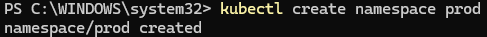

**Explanation:**
This command creates a "prod" namespace for production resources, demonstrating environment separation within the cluster.

---

### Step 4.3: List All Namespaces

**Command:**
```bash
kubectl get namespaces
```

**Output:**
```
NAME                  STATUS   AGE
default               Active   5m30s
dev                   Active   38s
kube-node-lease       Active   5m30s
kube-public           Active   5m30s
kube-system           Active   5m30s
local-path-storage    Active   5m24s
prod                  Active   11s
```

**Evidence:**

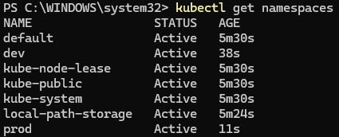

**Explanation:**
This command displays all namespaces in the cluster, including the newly created "dev" and "prod" namespaces along with default Kubernetes system namespaces.

---

### Step 4.4: Create Service Account

**Command:**
```bash
kubectl create serviceaccount dev-user -n dev
```

**Output:**
```
serviceaccount/dev-user created
```

**Evidence:**

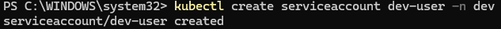

**Explanation:**
This command creates a service account named "dev-user" in the "dev" namespace. Service accounts provide an identity for processes running in pods and are used for authentication and authorization.

---

### Step 4.5: Create Custom Role

**Command:**
```bash
kubectl create role pod-reader -n dev --verb=get,list,watch --resource=pods
```

**Output:**
```
role.rbac.authorization.k8s.io/pod-reader created
```

**Evidence:**

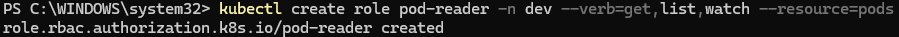

**Explanation:**
This command creates a Role named "pod-reader" in the "dev" namespace with specific permissions:
- **Verbs:** get, list, watch (read-only operations)
- **Resources:** pods
This implements the principle of least privilege by granting only the necessary permissions.

---

### Step 4.6: Create Role Binding

**Command:**
```bash
kubectl create rolebinding dev-user-binding -n dev --role=pod-reader --serviceaccount=dev:dev-user
```

**Output:**
```
rolebinding.rbac.authorization.k8s.io/dev-user-binding created
```

**Evidence:**

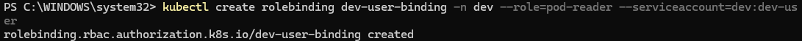

**Explanation:**
This command creates a RoleBinding that associates the "pod-reader" role with the "dev-user" service account in the "dev" namespace. This grants the service account the permissions defined in the role.

---

### Step 4.7: Test RBAC Permissions - List Pods in Dev Namespace (Allowed)

**Command:**
```bash
kubectl auth can-i list pods -n dev --as=system:serviceaccount:dev:dev-user
```

**Output:**
```
yes
```

**Evidence:**

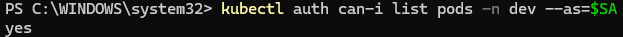

**Explanation:**
This command tests whether the dev-user service account has permission to list pods in the "dev" namespace. The output "yes" confirms that the permission is granted as configured in the role.

---

### Step 4.8: Test RBAC Permissions - Delete Pods in Dev Namespace (Denied)

**Command:**
```bash
kubectl auth can-i delete pods -n dev --as=system:serviceaccount:dev:dev-user
```

**Output:**
```
no
```

**Evidence:**

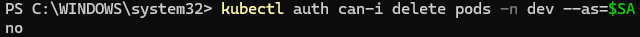

**Explanation:**
This command tests whether the dev-user service account can delete pods in the "dev" namespace. The output "no" confirms that delete permissions are not granted, demonstrating proper RBAC configuration and the principle of least privilege.

---

### Step 4.9: Test RBAC Permissions - List Pods in Prod Namespace (Denied)

**Command:**
```bash
kubectl auth can-i list pods -n prod --as=system:serviceaccount:dev:dev-user
```

**Output:**
```
no
```

**Evidence:**

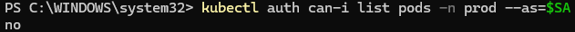

**Explanation:**
This command verifies that the dev-user service account cannot list pods in the "prod" namespace. This demonstrates namespace-level isolation where the role is only effective within the "dev" namespace.

---

### Step 4.10: Verify Role Binding Configuration

**Command:**
```bash
kubectl get rolebinding dev-user-binding -n dev -o yaml
```

**Output (Key Sections):**
```yaml
apiVersion: rbac.authorization.k8s.io/v1
kind: RoleBinding
metadata:
  creationTimestamp: "2026-08-02T11:16:20Z"
  name: dev-user-binding
  namespace: dev
  resourceVersion: "1376"
  uid: 0c2dca85-d8b0-40d0-bd22-e8f3be5d1b1d
roleRef:
  apiGroup: rbac.authorization.k8s.io
  kind: Role
  name: pod-reader
subjects:
- kind: ServiceAccount
  name: dev-user
  namespace: dev
```

**Evidence:**

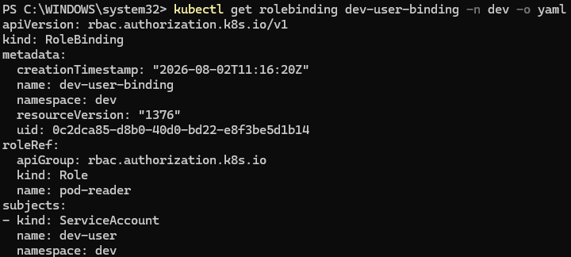

**Explanation:**
This command displays the complete YAML configuration of the RoleBinding, showing:
- The binding connects the "pod-reader" role to the "dev-user" service account
- The binding is scoped to the "dev" namespace
- All metadata including creation timestamp and resource version

---

## Conclusion

### Lab Summary

In this lab, we successfully completed the following tasks:

#### Part 1: LocalStack Setup
- Installed and configured LocalStack to simulate AWS services locally
- Verified the health and availability of LocalStack services

#### Part 2: IAM Management
- Created IAM groups (Admins) and users (CloudAdmin_Daniel, Analyst_Daniel)
- Implemented group-based permission management
- Attached AWS managed policies to users
- Generated and managed access keys for programmatic access
- Demonstrated the principle of least privilege through different permission levels

#### Part 3: Kubernetes Cluster
- Created a local Kubernetes cluster using Kind
- Verified cluster health and node status
- Set up multiple namespaces for environment separation

#### Part 4: Kubernetes RBAC
- Created service accounts for application identity
- Defined custom roles with specific permissions
- Implemented role bindings to grant permissions
- Tested and verified RBAC configurations
- Demonstrated namespace-level access control

### Key Learning Outcomes

1. **Identity and Access Management (IAM):**
   - Understanding of users, groups, and policies in AWS
   - Practical experience with access key management
   - Application of least privilege principle

2. **Kubernetes Security:**
   - Implementation of Role-Based Access Control (RBAC)
   - Understanding of service accounts and their role in authentication
   - Namespace-level resource isolation and access control

3. **Security Best Practices:**
   - Separation of duties through different permission levels
   - Environment isolation using namespaces
   - Testing and verification of security configurations
   - Avoiding excessive permissions

4. **Cloud Computing Concepts:**
   - Local development environments for cloud services
   - Container orchestration and cluster management
   - Security as a fundamental aspect of cloud architecture

### Real-World Applications

The skills demonstrated in this lab are directly applicable to:
- Setting up secure cloud environments in AWS
- Managing user access and permissions in production systems
- Implementing security controls in Kubernetes deployments
- Following compliance and security best practices
- DevOps and platform engineering workflows

---
