# Lab 2: Secure Isolation and Multitenancy

**Course:** IKB42603 Cloud Computing  
**Lab:** Lab 2 - Secure Isolation and Multitenancy  
**Date:** August 12, 2026  
**Student Name:** Muhammad Daniel Firdaus  
**Student ID:** 52215225183

---

## Table of Contents
1. [Introduction](#introduction)
2. [Objectives](#objectives)
3. [Lab Environment Setup](#lab-environment-setup)
4. [Part 1: Namespace Isolation](#part-1-namespace-isolation)
5. [Part 2: Resource Quotas](#part-2-resource-quotas)
6. [Part 3: Network Policies](#part-3-network-policies)
7. [Part 4: RBAC (Role-Based Access Control)](#part-4-rbac-role-based-access-control)
8. [Part 5: Data Isolation with Persistent Volumes](#part-5-data-isolation-with-persistent-volumes)
9. [Part 6: Cleanup](#part-6-cleanup)
10. [Conclusion](#conclusion)

---

## Introduction

This lab demonstrates secure isolation and multitenancy in Kubernetes environments. Multitenancy allows multiple users or teams to share the same cluster while maintaining isolation and security. This is achieved through namespaces, resource quotas, network policies, and Role-Based Access Control (RBAC).

---

## Objectives

By the end of this lab, you will be able to:
- Create and manage Kubernetes namespaces for tenant isolation
- Implement resource quotas to limit resource consumption
- Configure network policies for network-level isolation
- Set up RBAC to control access permissions
- Demonstrate data isolation using persistent volumes
- Verify isolation between tenants

---

## Lab Environment Setup

### Prerequisites
- Kubernetes cluster (kind/minikube/cloud provider)
- kubectl CLI tool installed and configured
- Docker installed (for volume testing)
- Basic understanding of Kubernetes concepts

### Cluster Information

Execute the following command to verify the cluster status:

```bash
kubectl get nodes
```

### Evidence:

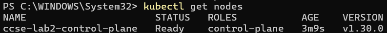

**Analysis:** The cluster is successfully running with a single control plane node in Ready status, using Kubernetes version v1.30.0.

---

## Part 1: Namespace Isolation

### Overview
Namespaces provide logical isolation between different tenants in a Kubernetes cluster. Each namespace acts as a virtual cluster within the physical cluster.

### Step 1.1: Create Namespaces for Two Tenants

Execute the following commands to create separate namespaces:

```bash
kubectl create namespace tenant-a
kubectl create namespace tenant-b
```

### Step 1.2: Deploy Applications in Each Namespace

**Deploy web application in tenant-a:**
```bash
kubectl create deployment web --image=nginx --namespace=tenant-a
kubectl expose deployment web --port=80 --type=ClusterIP --namespace=tenant-a
```

**Deploy web application in tenant-b:**
```bash
kubectl create deployment web --image=nginx --namespace=tenant-b
kubectl expose deployment web --port=80 --type=ClusterIP --namespace=tenant-b
```

### Step 1.3: Verify Deployments

**Check pods and services in tenant-a:**

```bash
kubectl get pods,svc -n tenant-a
```

### Evidence:

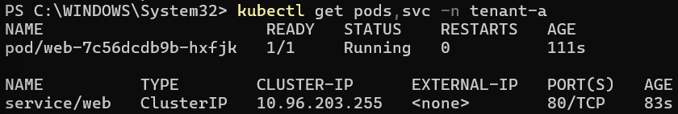

**Analysis:** Tenant-a has successfully deployed a web pod that is running and a ClusterIP service exposing port 80.

---

**Check pods and services in tenant-b:**

```bash
kubectl get pods,svc -n tenant-b
```

### Evidence:

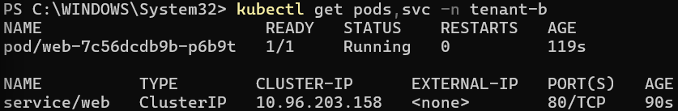

**Analysis:** Tenant-b also has a running web pod and service. Note that both namespaces can have resources with the same name (web) because they are isolated by namespace.

---

### Step 1.4: Extract Service IP Address

To test connectivity between namespaces, we need to get the ClusterIP of tenant-b's service:

```bash
kubectl get svc web -n tenant-b -o jsonpath='{.spec.clusterIP}'
```

### Evidence:

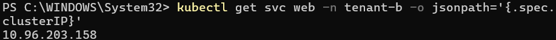

**Analysis:** The service in tenant-b is accessible at IP address 10.96.203.158 within the cluster.

---

### Step 1.5: Test Cross-Namespace Connectivity (Without Network Policies)

Test whether a pod in tenant-a can access the service in tenant-b:

```bash
kubectl -n tenant-a run probe --rm -it --image=curlimages/curl --restart=Never -- curl -s -m 5 http://10.96.203.158 -o /dev/null -w "HTTP %{http_code}\n"
```

### Evidence:

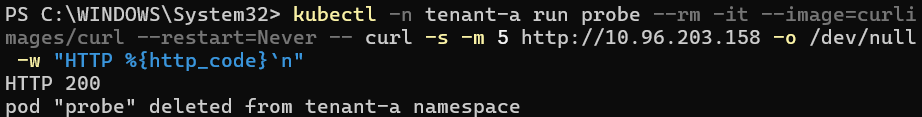

**Analysis:** Without network policies in place, pods from tenant-a can successfully communicate with services in tenant-b (HTTP 200 response). This demonstrates that **namespace isolation alone does NOT provide network-level security**. We need network policies to enforce isolation.

---

## Part 2: Resource Quotas

### Overview
Resource quotas prevent tenants from consuming excessive cluster resources and ensure fair resource allocation across multiple tenants.

### Step 2.1: Create Resource Quota for tenant-a

Create a file named `tenant-a-quota.yaml` with the following content:

```yaml
apiVersion: v1
kind: ResourceQuota
metadata:
  name: tenant-a-quota
  namespace: tenant-a
spec:
  hard:
    pods: "5"
    requests.cpu: "1"
    requests.memory: 512Mi
```

Apply the resource quota:

```bash
kubectl apply -f tenant-a-quota.yaml
```

### Step 2.2: Verify Resource Quota

Check the resource quota details:

```bash
kubectl describe resourcequota tenant-a-quota -n tenant-a
```

### Evidence:

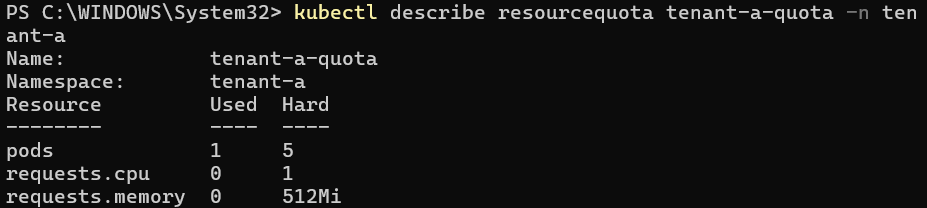

**Analysis:** 
- Maximum 5 pods allowed in tenant-a (currently 1 in use)
- Maximum 1 CPU core can be requested (currently 0 used because existing pods don't have resource requests)
- Maximum 512Mi memory can be requested (currently 0 used)

---

### Step 2.3: Test Resource Quota Enforcement

Create a pod manifest named `probe.yaml` with resource requests. The pod requests **100m CPU** and **64Mi memory**, which are within the resource quota configured for `tenant-a`.

```yaml
apiVersion: v1
kind: Pod
metadata:
  name: probe
  namespace: tenant-a
spec:
  restartPolicy: Never
  containers:
  - name: probe
    image: curlimages/curl
    resources:
      requests:
        cpu: 100m
        memory: 64Mi
    command:
    - curl
    - -s
    - -m
    - "5"
    - http://10.96.203.158
    - -o
    - /dev/null
    - -w
    - "HTTP %{http_code}\n"
```

### Evidence:

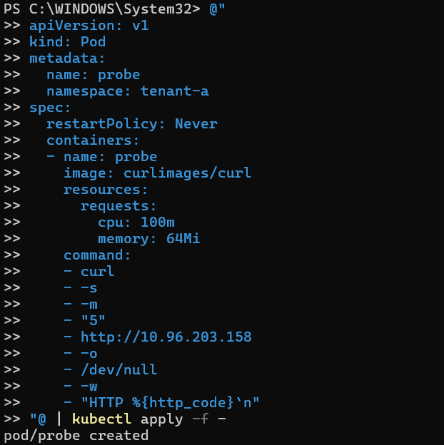

**Check the pod status:**

```bash
kubectl get pod probe -n tenant-a
```

### Evidence:

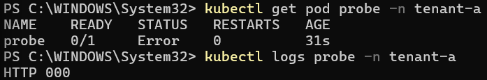

```
NAME    READY   STATUS   RESTARTS   AGE
probe   0/1     Error    0          31s
```

**Analysis:** The pod was created successfully, but its container entered the `Error` state after the command inside the container failed. This result is related to the connectivity test performed by the pod rather than to resource quota enforcement.

**Check the pod logs:**

```bash
kubectl logs probe -n tenant-a
```

### Evidence:


```
HTTP 000
```

**Analysis:** The `HTTP 000` result indicates that the curl request did not receive an HTTP response from the target service. In this lab, this is consistent with the network policy that was applied to `tenant-b`. Therefore, Screenshots 309 and 310 provide evidence for the network isolation test rather than proving that the resource quota was exceeded.

## Part 3: Network Policies

### Overview
Network policies provide network-level isolation by controlling traffic flow between pods and namespaces.

### Step 3.1: Create Network Policy for tenant-b

Create a file named `tenant-b-network-policy.yaml`:

```yaml
apiVersion: networking.k8s.io/v1
kind: NetworkPolicy
metadata:
  name: default-deny-ingress
  namespace: tenant-b
spec:
  podSelector: {}
  policyTypes:
  - Ingress
```

This policy implements a **default-deny** approach, blocking all incoming traffic to pods in tenant-b unless explicitly allowed.

Apply the network policy:

```bash
kubectl apply -f tenant-b-network-policy.yaml
```

### Step 3.2: Verify Network Policy

List all network policies across namespaces:

```bash
kubectl get networkpolicy -A
```

### Evidence:

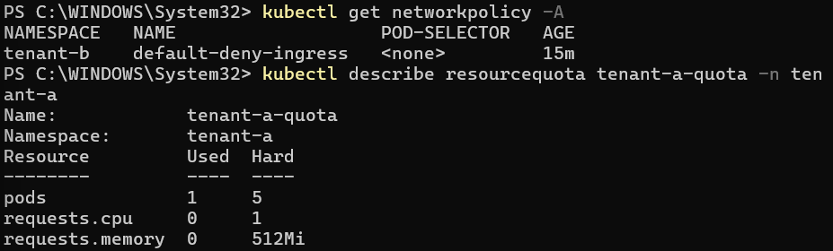

**Analysis:** The default-deny-ingress policy is active in tenant-b namespace with no pod selector (applies to all pods). This policy blocks all ingress traffic from other namespaces, including tenant-a.

---

### Step 3.3: Test Network Isolation

The probe pod created in Step 2.3 can be used to test connectivity from `tenant-a` to the service in `tenant-b`. Screenshots 309 and 310 show that the probe entered an `Error` state and returned `HTTP 000`, indicating that the request did not receive an HTTP response.

Because the default-deny ingress policy is active in `tenant-b`, the failed connection is evidence that incoming traffic to the tenant-b pods is being blocked.

**Key Point:** Network policies control Layer 3/4 network traffic between pods and are enforced by the cluster's CNI (Container Network Interface) implementation.

---

### Step 3.4: Verify Resource Quota Status After Testing

Check the resource quota again:

```bash
kubectl describe resourcequota tenant-a-quota -n tenant-a
```

### Evidence:


**Analysis:** The quota status shows the resources currently counted against `tenant-a`. The existing web deployment remains within the configured quota, while the completed probe pod is no longer contributing to the current usage. This confirms that Kubernetes continuously tracks quota usage as resources are created and removed.

---

## Part 4: RBAC (Role-Based Access Control)

### Overview
RBAC controls authorization - who can perform what actions on which resources. It provides access-level isolation between tenants.

### Step 4.1: Create Service Account for tenant-a

```bash
kubectl create serviceaccount tenant-a-user -n tenant-a
```

A service account represents an identity for processes running in pods.

### Step 4.2: Create Role for tenant-a

Create a file named `tenant-a-role.yaml`:

```yaml
apiVersion: rbac.authorization.k8s.io/v1
kind: Role
metadata:
  name: tenant-a-role
  namespace: tenant-a
rules:
- apiGroups: [""]
  resources: ["pods", "services"]
  verbs: ["get", "list", "watch"]
- apiGroups: [""]
  resources: ["secrets"]
  verbs: ["get"]
```

This Role grants read-only access to pods, services, and secrets within tenant-a namespace only.

Apply the role:

```bash
kubectl apply -f tenant-a-role.yaml
```

### Step 4.3: Create RoleBinding

Create a file named `tenant-a-rolebinding.yaml`:

```yaml
apiVersion: rbac.authorization.k8s.io/v1
kind: RoleBinding
metadata:
  name: tenant-a-rolebinding
  namespace: tenant-a
subjects:
- kind: ServiceAccount
  name: tenant-a-user
  namespace: tenant-a
roleRef:
  kind: Role
  name: tenant-a-role
  apiGroup: rbac.authorization.k8s.io
```

This RoleBinding connects the service account to the role.

Apply the rolebinding:

```bash
kubectl apply -f tenant-a-rolebinding.yaml
```

### Step 4.4: Test RBAC Permissions

**Test if service account can access secrets in tenant-a:**

```bash
kubectl auth can-i get secrets -n tenant-a --as=system:serviceaccount:tenant-a:tenant-a-user
```

### Evidence:

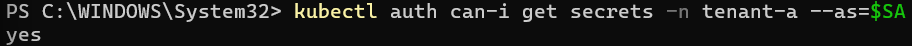

**Analysis:** The service account has permission to access secrets in its own namespace (tenant-a) because the Role explicitly grants this permission.

---

**Test if service account can access secrets in tenant-b:**

```bash
kubectl auth can-i get secrets -n tenant-b --as=system:serviceaccount:tenant-a:tenant-a-user
```

### Evidence:

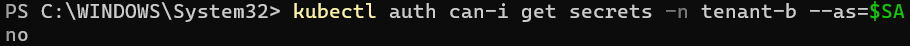

**Analysis:** The service account **cannot** access secrets in tenant-b. This demonstrates proper RBAC isolation - tenant-a's service account has no permissions in tenant-b's namespace.

**Key Takeaway:** RBAC provides authorization-level isolation. Even if network policies were removed, RBAC would still prevent unauthorized access to resources.

---

## Part 5: Data Isolation with Persistent Volumes

### Overview
This section demonstrates data isolation and security at the storage layer. We'll use Docker volumes to simulate persistent storage and show the importance of secure data handling.

### Step 5.1: Create a Docker Volume

Create a persistent volume to store data:

```bash
docker volume create ccse-vol
```

This creates a named volume managed by Docker.

### Step 5.2: Write Sensitive Data to Volume

Simulate writing and deleting sensitive patient data:

```bash
docker run --rm -v ccse-vol:/data alpine sh -c 'echo SENSITIVE-PATIENT-RECORD > /data/phi.txt; sync; rm /data/phi.txt; grep -a SENSITIVE /data/* 2>/dev/null; echo scan-done'
```

This command:
1. Writes sensitive data to a file (phi.txt)
2. Syncs to ensure data is written to disk
3. Deletes the file
4. Attempts to find any remnants of "SENSITIVE" in the volume
5. Outputs "scan-done"

### Evidence:

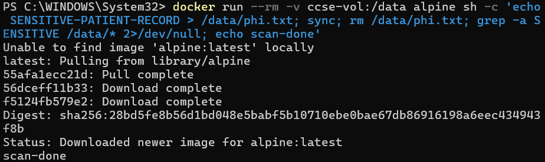

**Analysis:** The sensitive data (SENSITIVE-PATIENT-RECORD) was written to phi.txt and then deleted. The grep command found no remnants in the remaining files, showing "scan-done".

---

### Step 5.3: Attempt Data Recovery (Demonstrating Data Remnants)

Test if deleted data can be recovered or if overwriting helps:

```bash
docker run --rm -v ccse-vol:/data alpine sh -c 'echo SENSITIVE > /data/phi2.txt; sync; dd if=/dev/zero of=/data/phi2.txt bs=1k count=1 conv=notrunc; rm /data/phi2.txt; echo wiped'
```

This command:
1. Writes "SENSITIVE" to phi2.txt
2. Overwrites it with zeros using `dd`
3. Deletes the file
4. Outputs "wiped"

**Expected Output:**
```
1+0 records in
1+0 records out
1024 bytes (1.0kB) copied, 0.000074 seconds, 13.2MB/s
wiped
```
### Evidence:

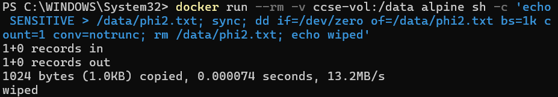

**Analysis:** This demonstrates that simply deleting files may leave data remnants on disk. In production environments with sensitive data:
- Use encrypted volumes (e.g., LUKS, cloud provider encryption)
- Implement secure deletion procedures
- Consider using file-level encryption
- Follow data retention policies

---

### Step 5.4: Data Isolation Best Practices

**Key Takeaways for Data Isolation:**

1. **Separate Volumes per Tenant**
   - Each tenant should have dedicated PersistentVolumes
   - Use StorageClasses to enforce isolation

2. **Encryption at Rest**
   - Encrypt volumes using platform encryption features
   - Use encrypted storage backends

3. **Access Controls**
   - Use PersistentVolumeClaim policies
   - Implement volume access modes (ReadWriteOnce, ReadOnlyMany, etc.)

4. **Secure Deletion**
   - Properly wipe volumes when decommissioning
   - Use secure deletion tools for sensitive data

5. **Audit and Compliance**
   - Log all volume access
   - Implement backup and disaster recovery with encryption

---

## Part 6: Cleanup

### Step 6.1: Delete the Kubernetes Cluster

Remove the Kind cluster to clean up all resources:

```bash
kind delete cluster --name ccse-lab2
```

### Evidence:

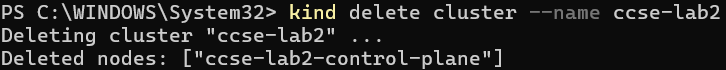

**Analysis:** This command removes the entire cluster including all namespaces, pods, services, network policies, and other resources.

---

### Step 6.2: Remove Docker Volume

Clean up the Docker volume used for testing:

```bash
docker volume rm ccse-vol
```

### Evidence:

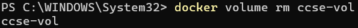

**Analysis:** This removes the persistent volume and all data stored in it.

---

## Conclusion

### Summary of Lab Activities

This lab successfully demonstrated multiple layers of isolation and security in a Kubernetes multitenancy environment:

| Isolation Layer | Technology | Purpose | Effectiveness |
|----------------|------------|---------|---------------|
| **Logical Isolation** | Namespaces | Separate tenant resources | ✅ Provides resource organization |
| **Resource Isolation** | Resource Quotas | Limit resource consumption | ✅ Prevents resource exhaustion |
| **Network Isolation** | Network Policies | Control traffic flow | ✅ Blocks unauthorized connections |
| **Access Isolation** | RBAC | Control authorization | ✅ Prevents unauthorized actions |
| **Data Isolation** | Persistent Volumes | Separate storage | ✅ Protects sensitive data |

---

### Key Learnings

1. **Defense in Depth**
   - Single isolation mechanism is insufficient
   - Multiple security layers provide comprehensive protection
   - Each layer addresses different attack vectors

2. **Namespace Limitations**
   - Namespaces provide logical separation only
   - Without network policies, cross-namespace communication is allowed
   - Namespaces are organizational, not security boundaries by themselves

3. **Resource Management**
   - Resource quotas prevent "noisy neighbor" problems
   - Quotas must be defined before pods with resource requests are created
   - Resource limits ensure fair allocation in shared clusters

4. **Network Security**
   - Default-deny policies are best practice
   - Network policies are namespace-scoped
   - Requires CNI plugin support (Calico, Cilium, Weave, etc.)

5. **Access Control**
   - RBAC is crucial for authorization
   - Service accounts should follow least-privilege principle
   - Roles are namespace-scoped; ClusterRoles are cluster-wide

6. **Data Security**
   - Deleted files may leave data remnants
   - Encryption and secure deletion are critical
   - Volume separation prevents cross-tenant data access

---

### Best Practices for Production Multitenancy

#### 1. Namespace Design
- Create separate namespaces per tenant/team/environment
- Use naming conventions (e.g., `tenant-{name}`, `team-{name}`)
- Document namespace ownership and purpose

#### 2. Resource Management
- Implement resource quotas for all tenant namespaces
- Use LimitRanges to set default resource limits
- Monitor quota usage and adjust as needed

#### 3. Network Security
- Implement default-deny network policies
- Explicitly allow only required traffic flows
- Use network policy selectors for fine-grained control
- Consider service mesh for advanced traffic management

#### 4. Access Control
- Follow least-privilege principle for all service accounts
- Use separate service accounts per application
- Regularly audit RBAC permissions
- Implement namespace-level admin roles carefully

#### 5. Pod Security
- Enable Pod Security Admission (PSA)
- Enforce restricted security standards
- Prohibit privileged containers
- Implement admission controllers (OPA/Gatekeeper)

#### 6. Storage Security
- Use separate StorageClasses per tenant
- Enable encryption at rest
- Implement volume snapshot policies
- Use ReadWriteOnce access mode when possible

#### 7. Monitoring and Auditing
- Enable audit logging for compliance
- Monitor resource usage per namespace
- Alert on quota violations
- Track network policy violations

#### 8. Secret Management
- Use external secret managers (Vault, AWS Secrets Manager)
- Encrypt secrets at rest
- Rotate credentials regularly
- Never commit secrets to version control

#### 9. Multi-Tenancy Patterns
- **Soft Multi-Tenancy**: Trusted tenants sharing cluster (demonstrated in this lab)
- **Hard Multi-Tenancy**: Untrusted tenants requiring stronger isolation
- Consider node isolation for hard multi-tenancy (node selectors, taints/tolerations)

#### 10. Compliance and Governance
- Implement policy-as-code (OPA, Kyverno)
- Regular security assessments
- Maintain compliance documentation
- Conduct tenant isolation testing

---

### Challenges Encountered

1. **Initial Cross-Namespace Communication**
   - **Issue**: Without network policies, tenant-a could access tenant-b
   - **Solution**: Implemented default-deny network policy
   - **Lesson**: Network policies must be configured proactively

2. **Resource Quota Enforcement**
   - **Issue**: Existing pods without resource requests don't count against CPU/memory quotas
   - **Solution**: New pods must specify resource requests
   - **Lesson**: Use LimitRanges to set defaults for resource requests

3. **Pod Error Status**
   - **Issue**: The probe pod entered an Error state during the connectivity test
   - **Cause**: The request to the tenant-b service did not receive an HTTP response after the default-deny network policy was applied
   - **Lesson**: The pod error is related to network connectivity testing, not resource quota enforcement

4. **Data Remnants**
   - **Issue**: Simple file deletion may leave recoverable data
   - **Solution**: Use secure deletion methods and encryption
   - **Lesson**: Storage-level security is critical for sensitive data

---

## Short Answer Questions

### Q1. Why can containers in different namespaces reach each other by default, and why is that dangerous in multi-tenant cloud?

Containers in different Kubernetes namespaces can communicate by default because the namespaces provide logical separation but they do not automatically block network traffic between tenants. Without a NetworkPolicy, a pod in one namespace can reach a service in another namespace. This is dangerous in a multi-tenant cloud because one tenant could access another tenant's applications or services without authorization.

### Q2. Explain the default-deny principle and how your NetworkPolicy implements it.

The default-deny principle means that all network traffic is blocked unless it is specifically allowed. In this lab, the `default-deny-ingress` NetworkPolicy is applied to `tenant-b` with an empty `podSelector`, which applies the policy to all pods in that namespace. As a result, incoming traffic from `tenant-a` is blocked unless an explicit rule is added to allow it. This demonstrates network isolation between tenants.

### Q3. How do virtual machines and containers differ in isolation strength? When would you add a VM boundary?

Virtual machines provide stronger isolation because each VM has its own operating system kernel, while containers share the host operating system kernel. Containers are therefore more lightweight but generally provide weaker isolation. A VM boundary should be added when tenants are untrusted, stronger security isolation is required or workloads have higher security and compliance requirements.

### Q4. What is data remanence, and why is cryptographic erasure the preferred cloud solution?

Data remanence is the persistence of data remnants even after the data has been deleted. In cloud environments, users usually do not control the physical storage blocks where their data is stored. Therefore, cryptographic erasure is preferred because destroying the encryption key makes the remaining encrypted data unreadable, even if physical copies still exist.

### Q5. Which of the three isolation dimensions (compute, network, storage) did each task exercise?

| Task | Isolation Dimension | Purpose |
|------|---------------------|---------|
| Task 1 | Compute | Separates Tenant A and Tenant B using Kubernetes namespaces. |
| Task 2 | Network | Demonstrates that cross-tenant communication is possible by default. |
| Task 3 | Compute | Uses ResourceQuota to limit resource consumption by Tenant A. |
| Task 4 | Network | Uses NetworkPolicy to block cross-tenant network traffic. |
| Task 5 | Storage | Uses per-tenant secrets and RBAC to prevent unauthorized access to another tenant's data. |
| Task 6 | Storage | Demonstrates data remanence and secure deletion. |
