# Lab 3: Encryption and Key Management

**Course:** IKB42603 Cloud Computing  
**Lab:** Lab 3 - Encryption and Key Management    
**Date:** August 21, 2026  
**Student Name:** Muhammad Daniel Firdaus  
**Student ID:** 52215225183

---

## Table of Contents
1. [Introduction](#introduction)
2. [Part 1: Symmetric Encryption with OpenSSL](#part-1-symmetric-encryption-with-openssl)
3. [Part 2: Asymmetric Encryption with RSA](#part-2-asymmetric-encryption-with-rsa)
4. [Part 3: Digital Signatures](#part-3-digital-signatures)
5. [Part 4: SSL/TLS in Practice](#part-4-ssltls-in-practice)
6. [Part 5: AWS KMS - Key Management Service](#part-5-aws-kms-key-management-service)
7. [Part 6: Data Key Encryption (Envelope Encryption)](#part-6-data-key-encryption-envelope-encryption)
8. [Part 7: Key Lifecycle Management](#part-7-key-lifecycle-management)
9. [Part 8: Data Integrity and File Hashing](#part-8-data-integrity-and-file-hashing)
10. [Conclusion](#conclusion)

---

## Introduction

This lab demonstrates various encryption techniques and key management practices essential for securing data in cloud computing environments. The exercises cover symmetric and asymmetric encryption, digital signatures, and cloud-based key management using AWS KMS.

---

## Part 1: Symmetric Encryption with OpenSSL

### Objective
Demonstrate symmetric encryption using AES-256-CBC algorithm to encrypt and decrypt sensitive data.

### Steps Performed

#### Step 1.1: Create Sample Data File
```powershell
PS C:\CCSE-Lab3> Get-Content record.txt
Patient: Ahmad, Diagnosis: confidential
```

### Evidence:

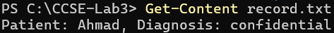

**Analysis:** Created a text file containing sensitive patient information to be encrypted.

---

#### Step 1.2: Encrypt the File Using AES-256-CBC
```powershell
PS C:\CCSE-Lab3> openssl enc -aes-256-cbc -pbkdf2 -salt -in record.txt -out record.enc
enter AES-256-CBC encryption password:
Verifying - enter AES-256-CBC encryption password:
```

### Evidence:

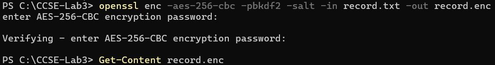

**Analysis:** The file was successfully encrypted with a password.

---

#### Step 1.3: Verify Encrypted Content
```powershell
PS C:\CCSE-Lab3> Get-Content record.enc
Salted__öV-ü蹔&#*?ö¤ö·ñöúlT®r'Ëé¯zj
Þ¿*þA¡pÛúK(éöà(fÜ*qŸ°
```

### Evidence:

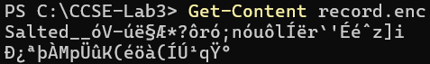

**Analysis:** The encrypted file contains unreadable binary data, confirming successful encryption.

---

#### Step 1.4: Decrypt the File
```powershell
PS C:\CCSE-Lab3> openssl enc -aes-256-cbc -pbkdf2 -salt -d -in record.enc -out record.dec.txt
enter AES-256-CBC decryption password:

PS C:\CCSE-Lab3> Get-Content record.dec.txt
Patient: Ahmad, Diagnosis: confidential
```

**Command Breakdown:**
- `-d`: Decrypt mode
- `-in record.enc`: Input encrypted file
- `-out record.dec.txt`: Output decrypted file

**Result:** Successfully decrypted the file and verified the original content was recovered.

---

#### Step 1.5: Verify Integrity with Hash Comparison
```powershell
PS C:\CCSE-Lab3> if ((Get-FileHash record.txt -Algorithm SHA256).Hash -eq (Get-FileHash record.dec.txt -Algorithm SHA256).Hash) {
>>     "MATCH: decryption successful"
>> }
MATCH: decryption successful
```

### Evidence:

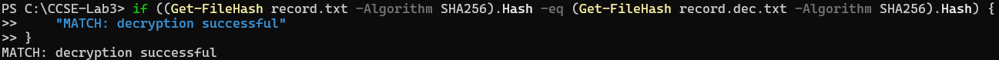

**Analysis:** Hash comparison confirms that decrypted content matches the original file exactly, proving successful encryption/decryption cycle.

---

## Part 2: Asymmetric Encryption with RSA

### Objective
Demonstrate public-key cryptography using RSA for secure data encryption without shared secrets.

### Steps Performed

#### Step 2.1: Generate RSA Key Pair
```powershell
PS C:\CCSE-Lab3> openssl genrsa -out private.pem 2048
```

**Command Breakdown:**
- `genrsa`: Generate RSA private key
- `-out private.pem`: Output file for private key
- `2048`: Key size in bits

**Result:** Generated a 2048-bit RSA private key.

---

#### Step 2.2: Extract Public Key
```powershell
PS C:\CCSE-Lab3> openssl rsa -in private.pem -pubout -out public.pem
```

**Command Breakdown:**
- `rsa`: RSA key processing
- `-in private.pem`: Input private key
- `-pubout`: Extract public key
- `-out public.pem`: Output public key file

---

#### Step 2.3: Verify Key Files
```powershell
PS C:\CCSE-Lab3> Get-ChildItem private.pem

    Directory: C:\CCSE-Lab3

Mode                LastWriteTime         Length Name
----                -------------         ------ ----
-a----        18/8/2026   7:33 PM           1732 private.pem
```

### Evidence:

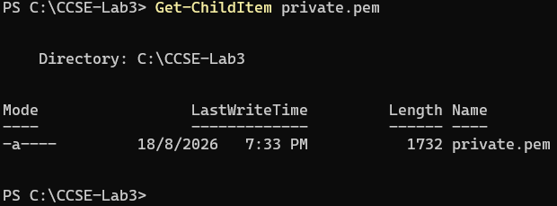

**Analysis:** Private key file created with 1732 bytes.

---

#### Step 2.4: View Both Keys
```powershell
PS C:\CCSE-Lab3> Get-ChildItem private.pem, public.pem

    Directory: C:\CCSE-Lab3

Mode                LastWriteTime         Length Name
----                -------------         ------ ----
-a----        18/8/2026   7:33 PM           1732 private.pem
-a----        18/8/2026   7:36 PM            460 public.pem
```

### Evidence:

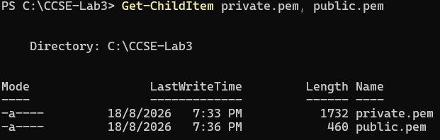

**Analysis:** Both private (1732 bytes) and public (460 bytes) keys successfully generated.

---

#### Step 2.5: Encrypt Data with Public Key
```powershell
PS C:\CCSE-Lab3> openssl pkeyutl -encrypt -pubin -inkey public.pem -in record.txt -out record.rsa
```

**Command Breakdown:**
- `pkeyutl`: Public key utility
- `-encrypt`: Encryption mode
- `-pubin`: Input is a public key
- `-inkey public.pem`: Public key file
- `-in record.txt`: Input plaintext
- `-out record.rsa`: Output encrypted file

---

#### Step 2.6: Decrypt Data with Private Key
```powershell
PS C:\CCSE-Lab3> openssl pkeyutl -decrypt -inkey private.pem -in record.rsa -out record.rsa.txt

PS C:\CCSE-Lab3> Get-Content record.rsa.txt
Patient: Ahmad, Diagnosis: confidential
```

### Evidence:

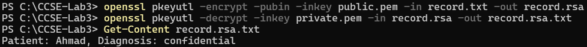

**Analysis:** Successfully decrypted using private key, recovering original plaintext.

---

## Part 3: Digital Signatures

### Objective
Implement digital signatures to ensure data authenticity and integrity.

### Steps Performed

#### Step 3.1: Create Digital Signature
```powershell
PS C:\CCSE-Lab3> openssl dgst -sha256 -sign private.pem -out record.sig record.txt
```

**Command Breakdown:**
- `dgst`: Digest/hash command
- `-sha256`: Use SHA-256 hashing algorithm
- `-sign private.pem`: Sign with private key
- `-out record.sig`: Output signature file
- `record.txt`: File to sign

**Result:** Created a digital signature for the record.txt file.

---

#### Step 3.2: Verify Digital Signature
```powershell
PS C:\CCSE-Lab3> openssl dgst -sha256 -verify public.pem -signature record.sig record.txt
Verified OK
```

### Evidence:

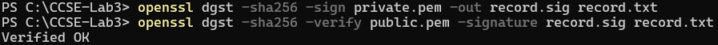

**Analysis:** Signature verification successful, confirming:
- Data authenticity (signed by holder of private key)
- Data integrity (content hasn't been modified)

---

## Part 4: SSL/TLS in Practice

### Objective
Demonstrate encrypted communication using SSL/TLS protocol over HTTPS.

### Steps Performed

#### Step 4.1: Access HTTPS Endpoint
```powershell
PS C:\CCSE-Lab3> curl.exe -k https://localhost:8443/record.txt
Patient: Ahmad, Diagnosis: confidential
```

### Evidence:

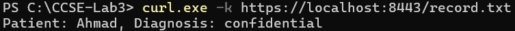

**Analysis:** Successfully retrieved data over encrypted HTTPS connection, demonstrating TLS in action.

---

## Part 5: AWS KMS - Key Management Service

### Objective
Create and manage encryption keys using AWS Key Management Service for cloud-based encryption.

### Steps Performed

#### Step 5.1: Create Master Key for Tenant A
```powershell
PS C:\CCSE-Lab3> aws --endpoint-url=http://localhost:4566 kms create-key --description "CCSE tenant-A master key"
```

### Evidence:


**Key Properties:**
- **KeyUsage:** ENCRYPT_DECRYPT
- **KeyState:** Enabled
- **KeyManager:** CUSTOMER (Customer Managed Key)
- **KeySpec:** SYMMETRIC_DEFAULT
- **Origin:** AWS_KMS

---

#### Step 5.2: Encrypt Data with KMS Master Key
```powershell
PS C:\CCSE-Lab3> aws --endpoint-url=http://localhost:4566 kms encrypt --key-id $KEY_A --plaintext "           " --query CiphertextBlob --output text
```

**Result:**
```
MzY2ZmHWYTMtZWIzMy00YmRhLWI0NDNdOTA5OTc4NTljZWFmckAMe6vCDVtcBWHKmE4I9bcrGJ1dQbvOpRdM0VQIqLqAZr6ECTCKEIo2GqBWQnh
```

### Evidence:

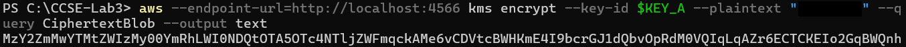

**Analysis:** The plaintext was encrypted using the KMS master key and returned as a base64-encoded ciphertext blob.

---

## Part 6: Data Key Encryption (Envelope Encryption)

### Objective
Implement envelope encryption pattern where data is encrypted with a data key, and the data key is encrypted with a master key.

### Steps Performed

#### Step 6.1: Generate Data Encryption Key (DEK)
```powershell
PS C:\CCSE-Lab3> aws --endpoint-url=http://localhost:4566 kms generate-data-key --key-id $KEY_A --key-spec AES_256
```

### Evidence:

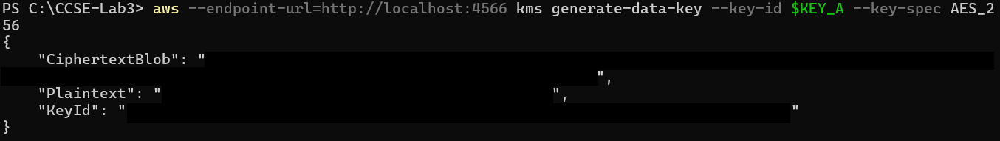

**Analysis:** KMS generated:
- Plaintext DEK: Used immediately to encrypt data
- Ciphertext DEK: Encrypted version stored with data

---

#### Step 6.2: Encrypt Data with Data Key
```powershell
PS C:\CCSE-Lab3> openssl enc -aes-256-cbc -pbkdf2 -in C:\CCSE-Lab3\record.txt -out C:\CCSE-Lab3\record.env.enc -pass file:C:\CCSE-Lab3\datakey.bin
```

**Command Breakdown:**
- Uses generated data key (datakey.bin) to encrypt the file
- `-pass file:`: Read encryption password from file
- Result: `record.env.enc` created

---

#### Step 6.3: Verify Encrypted Files
```powershell
PS C:\CCSE-Lab3> Get-ChildItem C:\CCSE-Lab3\record.env.enc

    Directory: C:\CCSE-Lab3

Mode                LastWriteTime         Length Name
----                -------------         ------ ----
-a----        21/8/2026   4:36 PM             64 record.env.enc
```

### Evidence:

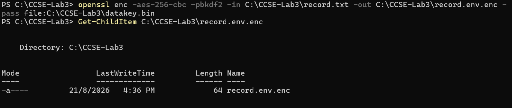

---

#### Step 6.4: Verify Encrypted Data Key
```powershell
PS C:\CCSE-Lab3> Get-ChildItem C:\CCSE-Lab3\datakey.*

    Directory: C:\CCSE-Lab3

Mode                LastWriteTime         Length Name
----                -------------         ------ ----
-a----        21/8/2026   4:34 PM            158 datakey.enc
```

### Evidence:

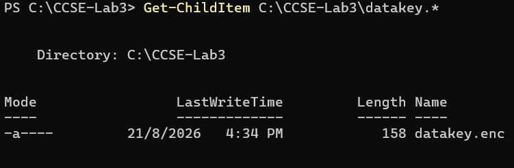

**Analysis:** The data key itself is encrypted and stored (158 bytes), following envelope encryption pattern.

---

## Part 7: Key Lifecycle Management

### Objective
Demonstrate proper key lifecycle management including key rotation and deletion.

### Steps Performed

#### Step 7.1: Create Master Key for Tenant B
```powershell
PS C:\CCSE-Lab3> aws --endpoint-url=http://localhost:4566 kms create-key --description "CCSE tenant-B master key"
```

### Evidence:

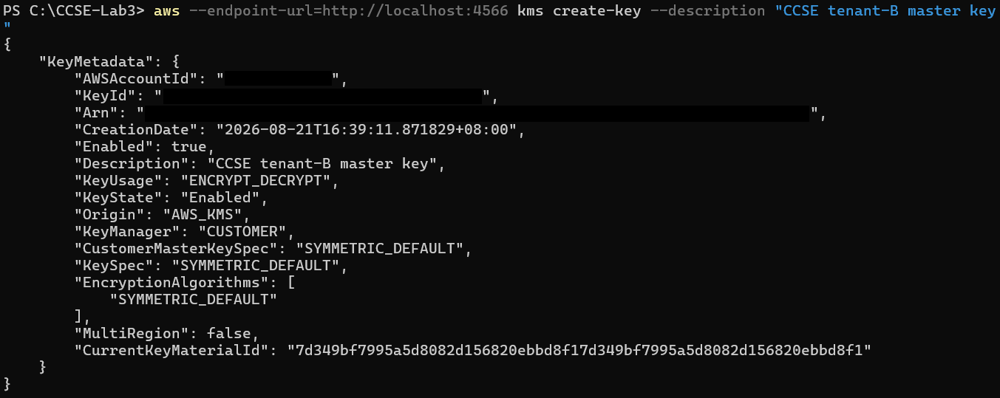

---

#### Step 7.2: Schedule Key Deletion
```powershell
PS C:\CCSE-Lab3> aws --endpoint-url=http://localhost:4566 kms schedule-key-deletion --key-id $KEY_A --pending-window-in-days 7
```

### Evidence:

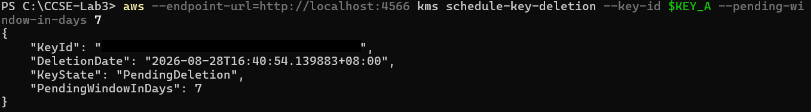

**Key Properties:**
- KeyState: PendingDeletion
- DeletionDate: 2026-08-28 (7 days from scheduling)
- PendingWindowInDays: 7

**Security Feature:** Mandatory waiting period prevents accidental key deletion.

---

#### Step 7.3: Verify Key is Disabled
```powershell
PS C:\CCSE-Lab3> aws --endpoint-url=http://localhost:4566 kms describe-key --key-id $KEY_A
```

### Evidence:

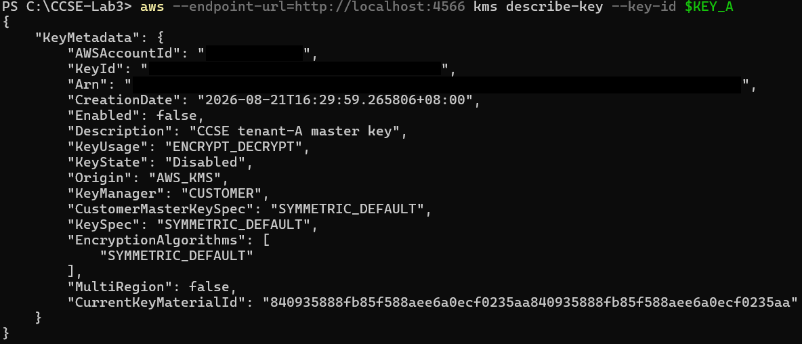

**Analysis:** Key state changed to "Disabled" with Enabled: false.

---

#### Step 7.4: Attempt to Decrypt with Disabled Key
```powershell
PS C:\CCSE-Lab3> Get-ChildItem C:\CCSE-Lab3\datakey-wrapped.bin

    Directory: C:\CCSE-Lab3

Mode                LastWriteTime         Length Name
----                -------------         ------ ----
-a----        21/8/2026   4:46 PM            116 datakey-wrapped.bin

PS C:\CCSE-Lab3> aws --endpoint-url=http://localhost:4566 kms decrypt --ciphertext-blob fileb://C:\CCSE-Lab3\datakey-wrapped.bin

aws: [ERROR]: An error occurred (DisabledException) when calling the Decrypt operation:
```

### Evidence:

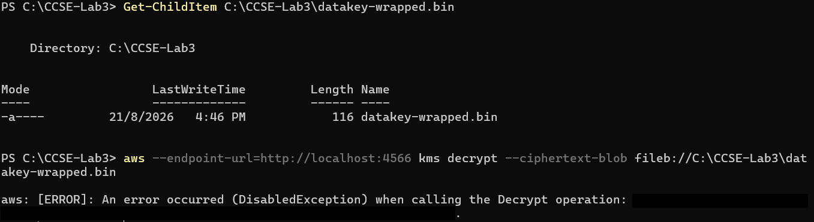

**Analysis:** Decryption operation fails with DisabledException, demonstrating that disabled/deleted keys cannot be used for cryptographic operations.

---

## Part 8: Data Integrity and File Hashing

### Objective
Demonstrate file integrity verification using cryptographic hash functions.

### Steps Performed

#### Step 8.1: Calculate Hash of Original File
```powershell
PS C:\CCSE-Lab3> Get-FileHash C:\CCSE-Lab3\record.txt -Algorithm SHA256

Algorithm       Hash                                                                   Path
---------       ----                                                                   ----
SHA256          5896485E6C14988B4B227B04C572032FA844EA40EC25BB4E6C43CC0ED76133B2       C:\CCSE-Lab3\record.txt
```

#### Step 8.2: Calculate Hash of Tampered File
```powershell
PS C:\CCSE-Lab3> Get-FileHash C:\CCSE-Lab3\tampered.txt -Algorithm SHA256

Algorithm       Hash                                                                   Path
---------       ----                                                                   ----
SHA256          61CAB18A9EFE6CE43AD4D1752E6AD1B201AE984A3E60B89B60B5158CFCD11343       C:\CCSE-Lab3\tampered...
```

### Evidence:

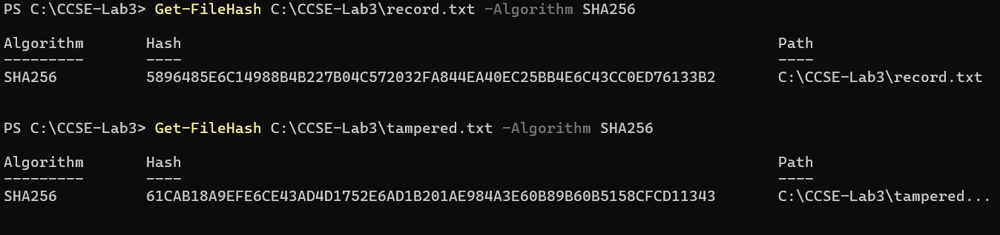

**Analysis:** Different hash values prove that even a small change in file content produces a completely different hash.

---

#### Step 8.3: Batch Hash Calculation with PowerShell
```powershell
PS C:\CCSE-Lab3> $PREV="0"
PS C:\CCSE-Lab3> foreach ($line in @("login ok","file read","export data")) {
>>     $bytes = [Text.Encoding]::UTF8.GetBytes("$PREV$line")
>>     $hash = [Security.Cryptography.SHA256]::Create().ComputeHash($bytes)
>>     $prev = ( [BitConverter]::ToString($hash) -replace "-","").ToLower()
>>     "$line | $PREV"
>> }
login ok | 573f9af26d45d395a1089ef5fec4d50ccddc17c0ea4269c2c91d90929a820053
file read | 6c3adc61ece69412b338e43d761435e95dbfc9482537f8f600087b0a4c5ad2d3d
export data | e1470ccfaf43dcab3c17d5710dc9eacbb7ac65c9f522ca98c2c50341b32da68
```

### Evidence:

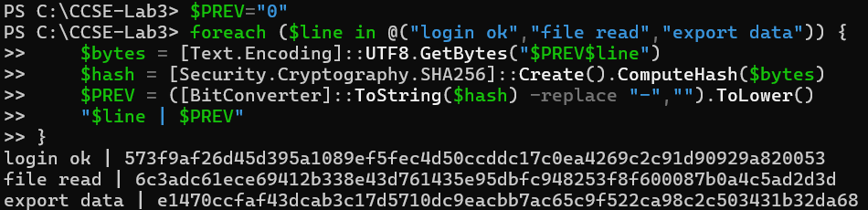

**Analysis:** Demonstrates chaining hashes - each hash incorporates the previous value, creating an audit trail similar to blockchain technology.

---

## Conclusion

### Lab Summary

This lab successfully demonstrated comprehensive encryption and key management techniques essential for cloud computing security:

1. **Symmetric Encryption (AES-256-CBC)**
   - Fast and efficient for large data
   - Requires secure key exchange
   - Used password-based key derivation (PBKDF2)

2. **Asymmetric Encryption (RSA)**
   - Public-key cryptography eliminates key exchange problem
   - Public key encrypts, private key decrypts
   - Slower, typically used for key exchange

3. **Digital Signatures**
   - Provides authentication and non-repudiation
   - Private key signs, public key verifies
   - Ensures data integrity and authenticity

4. **SSL/TLS**
   - Secures data in transit
   - Combines symmetric and asymmetric encryption
   - Essential for secure web communications

5. **AWS KMS**
   - Centralized key management service
   - Hardware Security Module (HSM) backed
   - Automatic key rotation and auditing
   - Fine-grained access control

6. **Envelope Encryption**
   - Best practice for large data encryption
   - Data key encrypts data
   - Master key encrypts data key
   - Improves performance and scalability

7. **Key Lifecycle Management**
   - Key creation, rotation, and deletion
   - Mandatory waiting periods prevent accidents
   - Disabled keys cannot perform operations
   - Critical for compliance and security

8. **Data Integrity**
   - Cryptographic hash functions (SHA-256)
   - Tamper detection through hash comparison
   - Hash chains create audit trails
   - Foundation for blockchain technology

---

### Security Best Practices Learned

✅ **Always use strong encryption algorithms** (AES-256, RSA-2048+)

✅ **Never hardcode encryption keys** in source code

✅ **Use key management services** (KMS) for centralized control

✅ **Implement key rotation policies** regularly

✅ **Use envelope encryption** for large datasets

✅ **Verify data integrity** with hash functions

✅ **Implement access control** on encryption keys

✅ **Enable audit logging** for key usage

✅ **Use digital signatures** for non-repudiation

✅ **Encrypt data in transit** (TLS) and at rest (AES)

---

### Real-World Applications

**Healthcare:** Protecting patient medical records (as demonstrated with "Patient: Ahmad, Diagnosis: confidential")

**Finance:** Securing financial transactions and sensitive customer data

**Cloud Storage:** Encrypting data stored in cloud services (S3, Azure Blob)

**E-commerce:** Securing payment information and customer data

**Government:** Protecting classified information and communications

**IoT Devices:** Securing device communications and firmware updates

---

### Lab Environment Details

**Operating System:** Windows
**Shell:** PowerShell
**Local Services:**
- LocalStack (AWS services emulator): http://localhost:4566
- HTTPS Test Server: https://localhost:8443

**Tools Version:**
- OpenSSL: Latest
- AWS CLI: v2
- PowerShell: 5.1+

---

## Short-Answer Questions

### Q1. Compare symmetric and asymmetric encryption: speed, key distribution and typical use.
 
Symmetric encryption is faster and is suitable for encrypting large amounts of data but the same secret key must be securely shared between the sender and receiver. Asymmetric encryption is slower but uses a public and private key pair, which makes key distribution easier. Symmetric encryption is commonly used for data encryption while the asymmetric encryption is typically used for key exchange and digital signatures.

### Q2. Why is key management described as the weakest link, not the algorithm?

Strong encryption can still be insecure if the encryption keys are poorly managed. Keys must be securely stored, distributed, rotated, controlled and eventually deleted. If an attacker obtains the key, the encryption can be bypassed regardless of how strong the algorithm is. Therefore, proper key management is critical to maintaining the security of encrypted data.

### Q3. Explain envelope encryption and why only the master key needs hardware-grade protection.

Envelope encryption uses a data encryption key (DEK) to encrypt the actual data, while a master key encrypts or "wraps" the DEK. The DEK can therefore be used for efficient data encryption, while the master key is kept securely in a KMS or hardware-backed system. This means the master key requires the strongest protection because it controls access to the protected data keys.

### Q4. How does cryptographic erasure achieve provable deletion where overwriting cannot (in the cloud)?
  
Cryptographic erasure works by destroying or disabling the key required to decrypt the encrypted data. Without the key, the encrypted data becomes unusable even if the physical data still exists in cloud storage. This is more practical in the cloud because the user cannot directly access or overwrite the provider's underlying storage. The lab demonstrates this by disabling Tenant A's key and showing that the wrapped data key can no longer be decrypted.

### Q5. How does a hash chain make a log tamper-evident (link to tamper-proof logs, Week 6)?

A hash chain links each log entry to the hash of the previous entry. If an earlier log entry is modified, its hash changes and causes the following hash values to no longer match the chain. This makes unauthorized changes detectable and provides a tamper-evident audit trail. The lab demonstrates this by including the previous hash when generating the hash for each new log entry.
