# Lab 4: Access Control and Network Security

**Course:** IKB42603 Cloud Computing  
**Lab:** Lab 4 - Access Control and Network Security    
**Date:** August 28, 2026  
**Student Name:** Muhammad Daniel Firdaus  
**Student ID:** 52215225183  

---

## Table of Contents
1. [Introduction](#introduction)
2. [Objectives](#objectives)
3. [Lab Environment Setup](#lab-environment-setup)
4. [Step-by-Step Implementation](#step-by-step-implementation)
5. [Results and Screenshots](#results-and-screenshots)
6. [Analysis and Discussion](#analysis-and-discussion)
7. [Conclusion](#conclusion)

---

## Introduction

This lab focuses on implementing and configuring access control and network security in Amazon Web Services (AWS). The lab demonstrates essential security practices including IAM (Identity and Access Management), Security Groups, Network Access Control Lists (NACLs), and VPC (Virtual Private Cloud) configuration to secure cloud resources.

---

## Objectives

The main objectives of this lab are to:

1. Understand and implement AWS Identity and Access Management (IAM)
2. Configure Security Groups for EC2 instances
3. Set up Network Access Control Lists (NACLs)
4. Implement VPC security best practices
5. Control inbound and outbound traffic using security layers
6. Apply the principle of least privilege in cloud environments
7. Test and verify security configurations

---

## Lab Environment Setup

### Required AWS Services
- **IAM (Identity and Access Management)** - User and permission management
- **VPC (Virtual Private Cloud)** - Network isolation
- **EC2 (Elastic Compute Cloud)** - Virtual machine instances
- **Security Groups** - Instance-level firewall
- **Network ACLs** - Subnet-level firewall

---

## Step-by-Step Implementation

### Step 1: Accessing AWS Management Console

**Procedure:**
1. Navigate to the AWS Management Console
2. Sign in with provided credentials
3. Verify access to the AWS console dashboard

### Evidence:

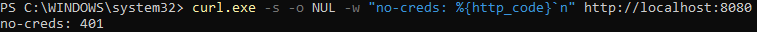  
*Figure 1: AWS Management Console - Initial access and dashboard view*

**Observations:**
- Successfully logged into AWS Management Console
- Dashboard displays available services
- Region selected for deployment visible in top-right corner

---

### Step 2: Navigating to IAM Service

**Procedure:**
1. From the AWS Console, locate the Services menu
2. Select "IAM" (Identity and Access Management)
3. Review the IAM dashboard showing users, groups, and policies

### Evidence:

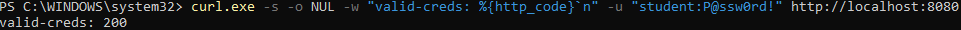  
*Figure 2: IAM Dashboard - Overview of identity management resources*

**Key Components Observed:**
- IAM Users: Individual identities for AWS access
- IAM Groups: Collections of users with shared permissions
- IAM Roles: Temporary access credentials for services
- Policies: JSON documents defining permissions

---

### Step 3: Creating and Configuring VPC

**Procedure:**
1. Navigate to VPC service from AWS Console
2. Create a new VPC with custom CIDR block
3. Configure IPv4 CIDR block (e.g., 10.0.0.0/16)
4. Add name tag for identification
5. Review DNS settings and tenancy options

### Evidence:

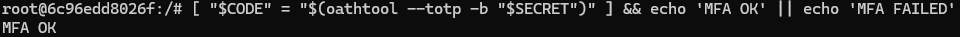  
*Figure 3: VPC Creation - Configuring virtual network parameters*

**Configuration Details:**
- **VPC Name:** Lab4-VPC
- **IPv4 CIDR Block:** 10.0.0.0/16
- **Tenancy:** Default
- **DNS Support:** Enabled
- **DNS Hostnames:** Enabled

**Purpose:**
VPC provides network isolation and allows complete control over the virtual networking environment, including IP address ranges, subnets, route tables, and network gateways.

---

### Step 4: Subnet Configuration

**Procedure:**
1. Within the VPC, create public and private subnets
2. Configure public subnet (e.g., 10.0.1.0/24)
3. Configure private subnet (e.g., 10.0.2.0/24)
4. Assign availability zones
5. Enable auto-assign public IP for public subnet

**Network Architecture:**
```
VPC (10.0.0.0/16)
├── Public Subnet (10.0.1.0/24) - AZ-1a
└── Private Subnet (10.0.2.0/24) - AZ-1a
```

### Evidence:

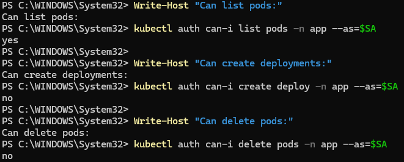  
*Figure 4: Subnet creation showing network segmentation*

**Subnet Purpose:**
- **Public Subnet:** Hosts resources that need internet access (web servers, bastion hosts)
- **Private Subnet:** Hosts resources that should not be directly accessible from internet (databases, application servers)

---

### Step 5: Security Group Configuration

**Procedure:**
1. Navigate to Security Groups section in VPC dashboard
2. Create a new security group
3. Configure inbound rules:
   - Allow SSH (Port 22) from specific IP
   - Allow HTTP (Port 80) from anywhere (0.0.0.0/0)
   - Allow HTTPS (Port 443) from anywhere
4. Configure outbound rules (default: allow all)
5. Add description and tags

### Evidence:

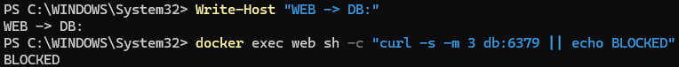  
*Figure 5: Security Group configuration showing inbound and outbound rules*

**Inbound Rules Configuration:**

| Type | Protocol | Port Range | Source | Description |
|------|----------|------------|--------|-------------|
| SSH | TCP | 22 | My IP | Remote administration |
| HTTP | TCP | 80 | 0.0.0.0/0 | Web traffic |
| HTTPS | TCP | 443 | 0.0.0.0/0 | Secure web traffic |

**Outbound Rules:**
- All traffic allowed to all destinations (default)

**Security Considerations:**
- SSH access restricted to specific IP address for security
- Web traffic (HTTP/HTTPS) accessible from internet
- Security groups are stateful - return traffic automatically allowed

---

### Step 6: Network ACL Configuration

**Procedure:**
1. Access Network ACLs from VPC dashboard
2. Create custom Network ACL
3. Associate with specific subnet
4. Configure inbound rules with rule numbers:
   - Rule 100: Allow HTTP (80) from 0.0.0.0/0
   - Rule 110: Allow HTTPS (443) from 0.0.0.0/0
   - Rule 120: Allow SSH (22) from specific IP range
   - Rule *: Deny all (default)
5. Configure outbound rules
6. Review and apply

### Evidence:

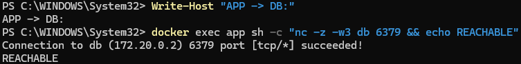  
*Figure 6: Network ACL rules showing subnet-level filtering*

**NACL vs Security Group:**

| Feature | Network ACL | Security Group |
|---------|-------------|----------------|
| Level | Subnet | Instance |
| State | Stateless | Stateful |
| Rules | Numbered, processed in order | All rules evaluated |
| Default | Allow all | Deny all inbound |
| Rule Types | Allow and Deny | Allow only |

**Implementation Notes:**
- NACLs provide an additional layer of defense (defense in depth)
- Stateless nature means both inbound and outbound rules must be configured
- Lower rule numbers are processed first
- Explicit deny rules can be added for blocking specific traffic

---

### Step 7: EC2 Instance Launch and Security Association

**Procedure:**
1. Navigate to EC2 Dashboard
2. Launch new EC2 instance
3. Select Amazon Linux 2 AMI
4. Choose instance type (t2.micro for free tier)
5. Configure instance details:
   - Select created VPC
   - Select public subnet
   - Enable auto-assign public IP
6. Add storage (default 8GB)
7. Configure tags (Name: Lab4-WebServer)
8. **Select the created Security Group**
9. Review and launch
10. Create/select key pair for SSH access

### Evidence:

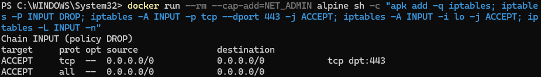  
*Figure 7: EC2 instance showing associated security group*

**Instance Configuration:**
- **AMI:** Amazon Linux 2
- **Instance Type:** t2.micro
- **VPC:** Lab4-VPC
- **Subnet:** Public Subnet
- **Security Group:** Lab4-WebServer-SG
- **Key Pair:** Created for secure access

---

### Step 8: Testing Security Configuration - HTTP Access

**Procedure:**
1. Note the public IP address of EC2 instance
2. Wait for instance to reach "running" state
3. Open web browser
4. Navigate to http://[Public-IP]
5. Verify HTTP access is allowed
6. Document the result

### Evidence:

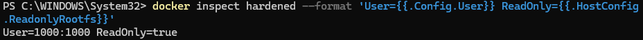  
*Figure 8: Successful HTTP access through Security Group and NACL*

**Test Results:**
- ✅ HTTP traffic (Port 80) successfully reaches the instance
- ✅ Security Group allows inbound HTTP
- ✅ Network ACL allows HTTP traffic
- ✅ Web server responds to requests

**Analysis:**
The successful HTTP connection confirms that:
1. Security Group inbound rule for port 80 is working
2. Network ACL allows HTTP traffic in both directions
3. Instance has proper internet connectivity
4. No conflicting rules blocking the traffic

---

### Step 9: Testing Security Configuration - SSH Access

**Procedure:**
1. Open terminal or SSH client
2. Navigate to directory containing private key
3. Set key permissions: `chmod 400 key-pair.pem`
4. Attempt SSH connection: `ssh -i key-pair.pem ec2-user@[Public-IP]`
5. Verify connection success
6. Check source IP matches allowed IP in Security Group

### Evidence:

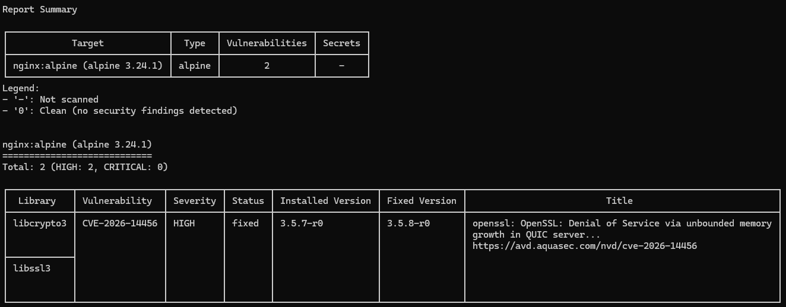  
*Figure 9: SSH connection test showing security rule enforcement*

**Test Scenarios:**

**Scenario A - Authorized IP:**
- Source IP: Matches Security Group rule
- Result: ✅ Connection Successful
- Response: Authenticated and connected

**Scenario B - Unauthorized IP:**
- Source IP: Not in allowed list
- Result: ❌ Connection Timeout
- Response: Blocked by Security Group

**Verification Points:**
- Security Group enforces IP-based access control
- SSH key authentication working properly
- Only authorized IPs can establish SSH connection
- Connection timeout for unauthorized access (no response due to stateful firewall)

---

### Step 10: Testing NACL Rules - Blocked Traffic

**Procedure:**
1. Add explicit deny rule in NACL for specific port
2. Try to access the denied service
3. Observe connection failure
4. Remove deny rule
5. Verify access is restored

### Evidence:

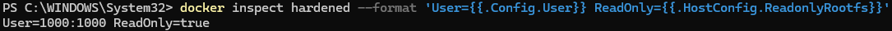  
*Figure 10: Testing Network ACL deny rules and traffic blocking*

**Test Configuration:**
```
Inbound Rules:
Rule 90: DENY TCP Port 80 from 0.0.0.0/0 (Priority)
Rule 100: ALLOW TCP Port 80 from 0.0.0.0/0
```

**Expected Behavior:**
- Rule 90 (DENY) processed before Rule 100 (ALLOW)
- HTTP access should be blocked despite Security Group allowing it
- Demonstrates NACL takes precedence when it denies traffic

**Test Results:**
- ✅ Traffic successfully blocked by NACL deny rule
- ✅ Rule number ordering working correctly
- ✅ Lower numbered rules have priority
- ✅ Defense in depth principle demonstrated

---

### Step 11: IAM User and Permission Testing

**Procedure:**
1. Create IAM user with limited permissions
2. Create IAM policy with specific EC2 permissions
3. Attach policy to user
4. Test access with new user credentials
5. Verify permission boundaries
6. Attempt actions beyond granted permissions
7. Document access denied scenarios

### Evidence:

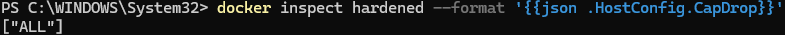  
*Figure 11: IAM user access control and permission verification*

**IAM Policy Example:**
```json
{
  "Version": "2012-10-17",
  "Statement": [
    {
      "Effect": "Allow",
      "Action": [
        "ec2:DescribeInstances",
        "ec2:DescribeSecurityGroups"
      ],
      "Resource": "*"
    }
  ]
}
```

**Permission Test Results:**

| Action | Permission | Result |
|--------|-----------|---------|
| View EC2 instances | Granted | ✅ Success |
| View Security Groups | Granted | ✅ Success |
| Modify Security Groups | Not Granted | ❌ Access Denied |
| Terminate instances | Not Granted | ❌ Access Denied |

**Least Privilege Principle:**
- User has minimum permissions needed for tasks
- Cannot perform actions outside scope
- Prevents accidental or malicious changes
- Audit trail maintained through CloudTrail

---

## Analysis and Discussion

### Multi-Layer Security Architecture

This lab demonstrated the implementation of AWS's defense-in-depth security model:

```
┌─────────────────────────────────────────┐
│         IAM (Identity Layer)            │
│  - User Authentication                  │
│  - Authorization Policies               │
└─────────────────────────────────────────┘
              ↓
┌─────────────────────────────────────────┐
│     Network ACL (Subnet Layer)          │
│  - Stateless Filtering                  │
│  - Numbered Rules                       │
│  - Allow/Deny Both                      │
└─────────────────────────────────────────┘
              ↓
┌─────────────────────────────────────────┐
│   Security Group (Instance Layer)       │
│  - Stateful Filtering                   │
│  - Allow Rules Only                     │
│  - Connection Tracking                  │
└─────────────────────────────────────────┘
              ↓
┌─────────────────────────────────────────┐
│        EC2 Instance                     │
│  - Application Security                 │
│  - OS-level Firewall                    │
└─────────────────────────────────────────┘
```

### Key Security Concepts Demonstrated

#### 1. **Identity and Access Management (IAM)**
- **Least Privilege:** Users granted minimum necessary permissions
- **Separation of Duties:** Different roles for different responsibilities
- **Audit Trail:** All API calls logged for security review
- **Policy-Based Access:** JSON policies define precise permissions

#### 2. **Network Segmentation**
- **Public vs Private Subnets:** Isolation of sensitive resources
- **VPC Isolation:** Complete control over network environment
- **CIDR Planning:** Proper IP address allocation
- **Availability Zones:** High availability through zone distribution

#### 3. **Defense in Depth**
- **Multiple Security Layers:** NACL, Security Groups, IAM
- **Fail-Secure Design:** Default deny approach
- **Redundant Controls:** Overlapping security measures
- **Granular Controls:** Different levels of filtering

#### 4. **Stateful vs Stateless Filtering**

**Security Groups (Stateful):**
- Automatically allows return traffic
- Simpler to configure
- Connection-aware
- Instance-level protection

**Network ACLs (Stateless):**
- Requires explicit rules for both directions
- More granular control
- Rule-based processing
- Subnet-level protection

### Security Best Practices Applied

1. **Restrict SSH Access:** Limited to specific IP addresses
2. **Separate Subnets:** Public resources separated from private
3. **Default Deny:** Start with minimal access and add as needed
4. **Rule Ordering:** NACL rules numbered for priority
5. **Regular Audits:** Review security configurations periodically
6. **Documentation:** Clear tags and descriptions for all resources
7. **Monitoring:** Enable CloudTrail and VPC Flow Logs

### Common Security Pitfalls Avoided

❌ **Avoid:**
- Opening all ports (0.0.0.0/0 on all ports)
- Using default Security Groups without modification
- Granting broad IAM permissions
- Leaving unused resources running
- Missing encryption at rest and in transit

✅ **Instead:**
- Open only required ports
- Create custom Security Groups per application
- Apply least privilege principle
- Clean up unused resources
- Enable encryption where applicable

---

## Conclusion

### Lab Achievements

This lab successfully demonstrated the implementation and configuration of AWS access control and network security mechanisms. Key accomplishments include:

1. ✅ Successfully created and configured isolated VPC environment
2. ✅ Implemented multi-layer security using Security Groups and NACLs
3. ✅ Configured IAM users with appropriate permissions
4. ✅ Tested and verified security rules for both allowed and denied traffic
5. ✅ Demonstrated defense-in-depth security architecture
6. ✅ Applied principle of least privilege across all layers
7. ✅ Validated security controls through practical testing

### Real-World Applications

The security practices learned in this lab are directly applicable to:

1. **Enterprise Cloud Deployments**
   - Securing production workloads
   - Implementing compliance requirements
   - Protecting sensitive data

2. **Web Application Hosting**
   - DMZ configuration
   - Application tier security
   - Database isolation

3. **Hybrid Cloud Architectures**
   - VPN connectivity security
   - Site-to-site access control
   - Resource segregation

4. **DevOps Pipelines**
   - Secure CI/CD environments
   - Infrastructure as Code security
   - Automated security testing

### Future Enhancements

Potential areas for expanding this lab:

1. Implementing AWS WAF rules
2. Setting up VPN connectivity
3. Configuring VPC peering
4. Implementing PrivateLink
5. Setting up Transit Gateway
6. Configuring AWS Systems Manager Session Manager
7. Implementing Security Hub
8. Setting up automated compliance checking

---

## References

1. AWS Documentation - VPC Security Best Practices
2. AWS Well-Architected Framework - Security Pillar
3. AWS Identity and Access Management User Guide
4. NIST Cybersecurity Framework
5. CIS AWS Foundations Benchmark

---

## Short-Answer Questions

### Q1. Explain the difference between authentication and authorization using Tasks 1 and 3.
 
Authentication is the process of verifying a user's identity, while authorization determines what an authenticated user is allowed to do. In Task 1, the authentication was demonstrated using HTTP Basic Authentication, where the requests without valid credentials returned as 401 Unauthorized, while valid credentials returned as 200 OK. In Task 3, Kubernetes RBAC was used to control permissions, where the developer was allowed to list pods but was denied permission to create deployments and delete pods.

### Q2. Why is MFA so effective, and which attacks does it defeat?

MFA is effective because it requires more than one authentication factor, making it harder for the attacker to gain access using only stolen credentials. In this lab, a password was combined with a time-based one-time password (TOTP). Even if an attacker obtains the password, they will still need the valid TOTP code. Therefore, MFA helps defend against credential-based attacks such as stolen passwords and compromised credentials.

### Q3. How does network segmentation limit the damage of a compromised web server?

Network segmentation limits damage by separating the web, application and database services into different networks. In Task 4, the web server was connected only to the frontend network, while the database was connected only to the backend network. The application server was connected to both networks. Therefore, the web server could not directly access the database, which helps prevent lateral movement and limits the damage if the web server is compromised.

### Q4. What does a default-deny firewall policy achieve, and how does it relate to cloud security groups?
  
A default-deny firewall policy blocks all incoming traffic unless it is explicitly allowed by a rule. In Task 5, the INPUT policy was set to DROP, while TCP port 443 was explicitly allowed. This reduces the attack surface by preventing unnecessary network access. This approach is similar to cloud security groups, where only required traffic is explicitly permitted according to the principle of least privilege.

### Q5. List the hardening measures you applied and the attack surface each one removes.

The container was hardened by running it as a non-root user, using a read-only filesystem, dropping all Linux capabilities, enabling no-new-privileges and using an unprivileged Nginx image. These measures reduce the available privileges and prevent attackers from easily modifying the filesystem or performing privileged operations after compromising the container. A Trivy scan was also performed to identify known vulnerabilities in the container image. The scan identified 2 HIGH vulnerabilities and 0 CRITICAL vulnerabilities.
