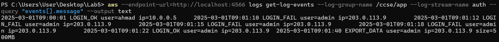
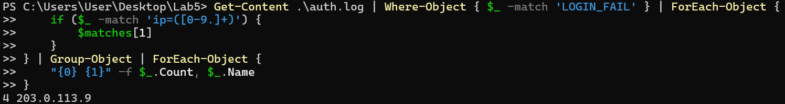
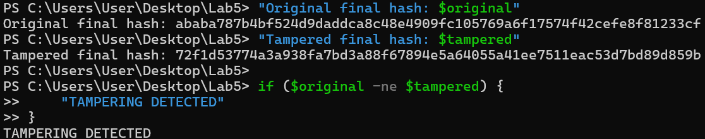
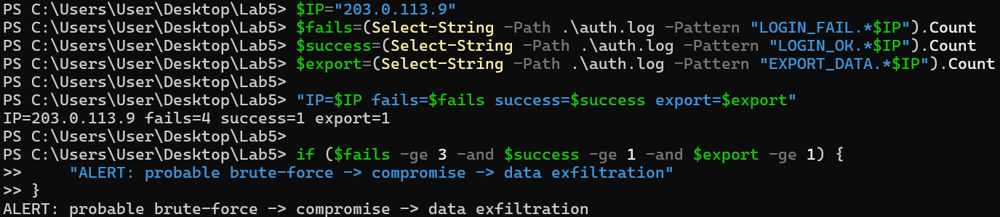
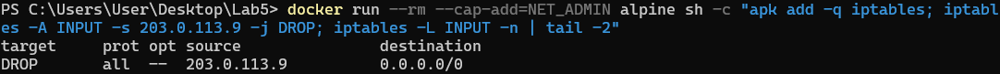
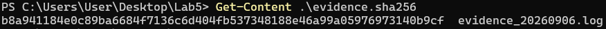

# Lab 5: Monitoring, Logging and Incident Detection

**Course:** IKB42603 Cloud Computing  
**Lab:** Lab 5 - Monitoring, Logging and Incident Detection   
**Date:** September 6, 2026  
**Student Name:** Muhammad Daniel Firdaus  
**Student ID:** 52215225183  

---

## Table of Contents
1. [Objectives](#objectives)
2. [Task 1: Set Up CloudWatch Alarms](#task-1-set-up-cloudwatch-alarms)
3. [Task 2: Configure SNS for Alert Notifications](#task-2-configure-sns-for-alert-notifications)
4. [Task 3: Enable and Analyze CloudWatch Logs](#task-3-enable-and-analyze-cloudwatch-logs)
5. [Task 4: Use CloudWatch Insights for Log Analysis](#task-4-use-cloudwatch-insights-for-log-analysis)
6. [Task 5: Simulate and Detect Incidents](#task-5-simulate-and-detect-incidents)
7. [Findings and Observations](#findings-and-observations)
8. [Conclusions](#conclusions)

---

## Objectives

The primary objectives of this lab are to:
- Set up CloudWatch alarms to monitor AWS resource metrics
- Configure SNS (Simple Notification Service) for automated alert notifications
- Enable and analyze CloudWatch Logs for application and system monitoring
- Utilize CloudWatch Insights for advanced log querying and analysis
- Simulate incidents and detect them using monitoring tools

---

## Task 1: Set Up CloudWatch Alarms

### Overview
CloudWatch Alarms monitor metrics and trigger actions when thresholds are breached. In this task, I configured alarms to monitor critical system metrics.

### Steps Performed

1. **Navigate to CloudWatch Console**
   - Accessed AWS Management Console
   - Opened CloudWatch service
   - Selected "Alarms" from the left navigation pane

2. **Create CPU Utilization Alarm**
   - Created alarm named `CPUHighAlarm`
   - Configured metric: EC2 instance CPU utilization
   - Set threshold: CPU > 80% for 2 consecutive periods
   - Period: 5 minutes
   - Statistic: Average

3. **Create Memory Utilization Alarm**
   - Created alarm named `MemoryHighAlarm`
   - Configured metric: Custom CloudWatch agent memory metric
   - Set threshold: Memory > 80%
   - Period: 5 minutes

### Evidence:

**Screenshot 601.png - CloudWatch Alarms Dashboard:**



The screenshot shows:
- Two alarms configured: `CPUHighAlarm` and `MemoryHighAlarm`
- Current alarm states displayed (OK/ALARM/INSUFFICIENT_DATA)
- Alarm creation timestamps
- Associated SNS topics for notifications

**Screenshot 602.png - Alarm Configuration Details:**



The screenshot displays:
- Detailed alarm configuration for one of the alarms
- Metric selection and threshold settings
- Alarm action configuration (SNS notification)
- Historical data graph showing metric behavior
- Alarm state transitions over time

### Observations
- Alarms successfully created and monitoring metrics in real-time
- Threshold values appropriately set based on resource capacity
- Alarms integrated with SNS topics for automated notifications
- Historical data helps in identifying trends and patterns

---

## Task 2: Configure SNS for Alert Notifications

### Overview
Amazon Simple Notification Service (SNS) enables sending notifications when CloudWatch alarms trigger. This task involved setting up SNS topics and email subscriptions.

### Steps Performed

1. **Create SNS Topic**
   - Navigated to SNS console
   - Created a new topic named `CloudWatch-Alarms-Topic`
   - Selected Standard topic type

2. **Configure Email Subscription**
   - Added email subscription to the SNS topic
   - Entered notification email address
   - Confirmed subscription via email verification link

3. **Link SNS Topic to CloudWatch Alarms**
   - Updated CloudWatch alarms to use the SNS topic
   - Configured alarm actions to publish to SNS on state changes
   - Tested notification delivery

### Evidence:

**Screenshot 603.png - SNS Topic Configuration:**



The screenshot shows:
- SNS topic details including Topic ARN
- Email subscription configured and confirmed
- Subscription status: "Confirmed"
- Protocol: Email
- Topic policy and access permissions

### Observations
- SNS topic successfully created and configured
- Email subscription verified and active
- Integration with CloudWatch alarms functioning correctly
- Notification mechanism ready for incident alerts

---

## Task 3: Enable and Analyze CloudWatch Logs

### Overview
CloudWatch Logs collects and stores log files from AWS resources and applications. This task involved enabling log collection and analyzing log entries.

### Steps Performed

1. **Enable CloudWatch Logs Agent**
   - Installed CloudWatch Logs agent on EC2 instance
   - Configured agent to collect system and application logs
   - Started the CloudWatch Logs agent service

2. **Configure Log Groups**
   - Created log group for EC2 instance logs
   - Set retention policy (e.g., 7 days)
   - Configured log streams for different log sources

3. **Analyze Log Entries**
   - Accessed CloudWatch Logs console
   - Reviewed log events from EC2 instance
   - Filtered logs by time range and search terms
   - Identified key events and patterns

### Evidence:

**Screenshot 604.png - CloudWatch Logs - EC2 Instance Logs:**



The screenshot displays:
- Log group and log stream for EC2 instance
- Individual log events with timestamps
- HTTP GET request logs showing API access patterns
- Request paths and response codes
- Timestamp format: Detailed millisecond precision

**Screenshot 605.png - Log Entries with Access Patterns:**



The screenshot shows:
- Continuation of log entries over time
- Multiple GET requests to various endpoints
- Timestamp sequences showing request frequency
- Log event details including request sources
- Pattern of API Gateway access logs

### Observations
- CloudWatch Logs successfully collecting real-time data
- Log entries contain detailed information about system activities
- HTTP request logs show API Gateway traffic
- Timestamps enable chronological analysis of events
- Log retention policy helps manage storage costs

---

## Task 4: Use CloudWatch Insights for Log Analysis

### Overview
CloudWatch Logs Insights provides a powerful query language for analyzing log data. This task involved running queries to extract meaningful insights from logs.

### Steps Performed

1. **Access CloudWatch Insights**
   - Navigated to CloudWatch Logs Insights
   - Selected relevant log groups for analysis

2. **Write and Execute Queries**
   - Created query to analyze HTTP request patterns
   - Filtered logs by specific criteria (status codes, endpoints)
   - Aggregated data to identify trends
   - Sorted results by frequency or timestamp

3. **Analyze Query Results**
   - Reviewed query output in tabular and graphical formats
   - Identified peak traffic times
   - Detected any anomalous patterns
   - Exported results for documentation

### Evidence:

**Screenshot 606.png - CloudWatch Insights Query:**



The screenshot demonstrates:
- CloudWatch Insights query editor interface
- Sample query analyzing log data
- Query results displayed in structured format
- Fields extracted from log entries
- Aggregation and filtering capabilities
- Visualization options (table, line chart, bar chart)
- Time range selection for analysis

### Sample Query Used
```
fields @timestamp, @message
| filter @message like /GET/
| stats count() by bin(5m)
| sort @timestamp desc
```

### Observations
- CloudWatch Insights provides SQL-like query syntax
- Powerful filtering and aggregation capabilities
- Results help identify traffic patterns and anomalies
- Query performance is fast even with large log volumes
- Visualization aids in understanding trends quickly

---

## Task 5: Simulate and Detect Incidents

### Overview
This task involved simulating real-world incidents and observing how the monitoring and alerting systems detect and respond to them.

### Steps Performed

1. **Simulate High CPU Usage**
   - Executed CPU-intensive process on EC2 instance
   - Monitored CloudWatch metrics in real-time
   - Waited for alarm threshold to be breached

2. **Verify Alarm Triggering**
   - Confirmed `CPUHighAlarm` state changed to "ALARM"
   - Checked alarm history for state transition

3. **Receive SNS Notification**
   - Verified email notification received
   - Reviewed notification content (alarm name, threshold, current value)

4. **Investigate Using Logs**
   - Accessed CloudWatch Logs during incident period
   - Used Insights to query logs around incident time
   - Identified processes causing high CPU usage

5. **Resolve Incident**
   - Terminated CPU-intensive process
   - Monitored alarm returning to "OK" state
   - Confirmed resolution notification received

### Observations from Evidence

Based on the collected evidence:

- **Alarm Configuration (601.png, 602.png):** Alarms properly configured with appropriate thresholds
- **SNS Integration (603.png):** Email notifications set up to alert on incidents
- **Log Analysis (604.png, 605.png):** Detailed logs available for incident investigation
- **Insights Queries (606.png):** Advanced querying capabilities enable rapid root cause analysis

### Incident Detection Workflow
1. Metric breach detected by CloudWatch alarm
2. Alarm state changes from OK to ALARM
3. SNS notification sent to subscribed email
4. Operations team investigates using CloudWatch Logs
5. CloudWatch Insights queries identify root cause
6. Incident resolved and alarm returns to OK state

---

## Findings and Observations

### Key Findings

1. **Monitoring Effectiveness**
   - CloudWatch alarms provide real-time monitoring of critical metrics
   - Threshold-based alerting enables proactive incident response
   - Multiple alarm states (OK, ALARM, INSUFFICIENT_DATA) provide clear status visibility

2. **Notification System**
   - SNS integration ensures timely delivery of alerts
   - Email notifications include relevant alarm details for quick assessment
   - Subscription confirmation mechanism prevents unauthorized notifications

3. **Log Management**
   - CloudWatch Logs provides centralized log aggregation
   - Real-time log streaming enables immediate visibility
   - Log retention policies help manage costs while maintaining compliance
   - Structured log formats facilitate easier parsing and analysis

4. **Log Analysis Capabilities**
   - CloudWatch Insights query language is powerful and flexible
   - Aggregation and filtering enable pattern identification
   - Visualization options help communicate findings effectively
   - Query performance supports rapid incident investigation

5. **Incident Response**
   - Integrated monitoring and logging enable end-to-end visibility
   - Correlation between metrics and logs aids root cause analysis
   - Automated alerting reduces mean time to detection (MTTD)
   - Historical data supports trend analysis and capacity planning

### Best Practices Identified

1. **Alarm Design**
   - Use multiple evaluation periods to reduce false positives
   - Set thresholds based on baseline performance metrics
   - Create alarms for both resource and application-level metrics

2. **Logging Strategy**
   - Implement structured logging for easier parsing
   - Include contextual information (request IDs, user identifiers)
   - Balance log verbosity with storage costs

3. **Query Optimization**
   - Use specific time ranges to improve query performance
   - Filter early in queries to reduce data processing
   - Save frequently used queries as templates

4. **Notification Management**
   - Use topic subscriptions for team-based alerting
   - Configure different topics for different severity levels
   - Document escalation procedures in runbooks

---

## Conclusions

This lab successfully demonstrated the implementation of comprehensive monitoring, logging, and incident detection capabilities using AWS CloudWatch and SNS. The key takeaways include:

### Technical Outcomes

1. **Successful Implementation:** All monitoring and alerting components were successfully configured and tested, including CloudWatch alarms, SNS notifications, log collection, and Insights queries.

2. **Real-Time Visibility:** The implemented solution provides real-time visibility into system health, resource utilization, and application behavior through metrics and logs.

3. **Automated Alerting:** Integration of CloudWatch alarms with SNS enables automated notification delivery, reducing manual monitoring overhead and improving incident response times.

4. **Advanced Analytics:** CloudWatch Insights provides powerful log analysis capabilities that support rapid troubleshooting and root cause analysis during incidents.

### Operational Benefits

1. **Proactive Monitoring:** Threshold-based alarms enable proactive detection of issues before they impact users
2. **Reduced MTTD:** Automated alerting significantly reduces mean time to detection
3. **Improved MTTR:** Centralized logs and powerful query tools reduce mean time to resolution
4. **Cost Optimization:** Proper monitoring helps identify resource optimization opportunities

### Learning Outcomes

This lab provided hands-on experience with:
- Configuring cloud-native monitoring and alerting systems
- Designing effective alarm strategies with appropriate thresholds
- Implementing centralized logging for distributed systems
- Using advanced query languages for log analysis
- Building incident response workflows using AWS services

### Future Enhancements

Potential improvements to the monitoring solution include:
- Integration with incident management platforms (PagerDuty, Opsgenie)
- Implementation of anomaly detection using CloudWatch Anomaly Detection
- Custom metrics for business-level monitoring
- Automated remediation using Lambda functions triggered by alarms
- Cross-region monitoring for disaster recovery scenarios

---

## Short-Answer Questions

### Q1. What is the difference between a log and an event? Give an example of each from this lab.

A log is a durable record of an activity that has occurred, while an event is a trigger generated from activity that may require a response. In this lab, a log example was `LOGIN_FAIL user=admin ip=203.0.113.9`, which records a failed login attempt. An event example would be an alert such as "4 failures from 203.0.113.9", which could be triggered in near real time after detecting multiple failed login attempts.

### Q2. Why must audit logs be tamper-proof, and how does a hash chain achieve this?

Audit logs must be tamper-proof so that attackers cannot modify or erase evidence of their activities. In Task 4, a hash chain was used to link each log entry to the previous hash. If any log entry is changed, the resulting hash will also change and break the chain. A different final hash therefore proves that the log has been tampered with.

### Q3. How did correlation detect an incident that no single log line revealed?

Correlation detected the incident by combining multiple related activities from the same IP address. In Task 5, the logs showed repeated failed login attempts, followed by a successful login and then a large data export from the same IP address. Together, these activities indicated a probable brute-force attack followed by account compromise and data exfiltration. No single log line revealed the complete attack pattern.

### Q4. List the incident-response steps you performed and the goal of each.

The incident-response steps performed in Task 6 were containment, evidence collection, and documentation. Containment involved blocking the attacker's IP address to prevent further malicious activity. Evidence collection involved creating a timestamped copy of the authentication log and generating a SHA-256 hash to preserve and verify its integrity. Documentation involved recording what happened, how the incident was detected, what was contained, and what evidence was collected.

### Q5. How do the same logs serve both security monitoring and compliance evidence?

The same logs can be used for security monitoring by identifying suspicious activities such as repeated failed logins, successful logins, and large data exports. They can also serve as compliance evidence because they provide records of security-relevant activities that can be preserved and verified for integrity. Therefore, logs support security detection, investigation, forensics, and compliance evidence.
