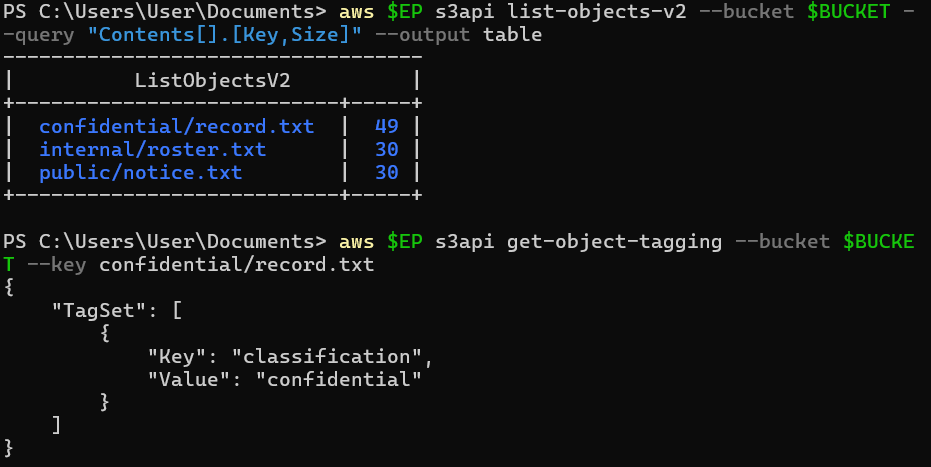
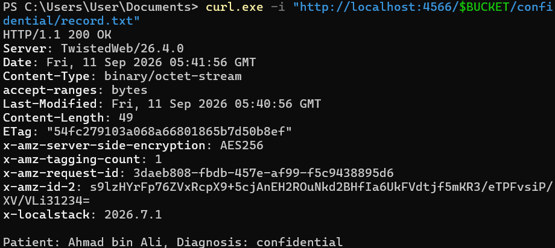
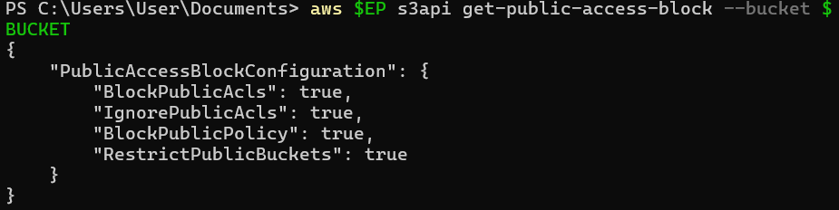
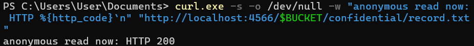
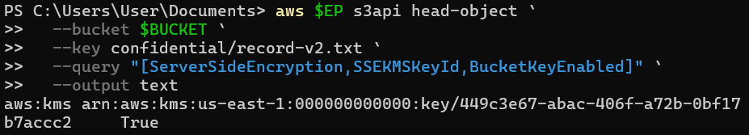
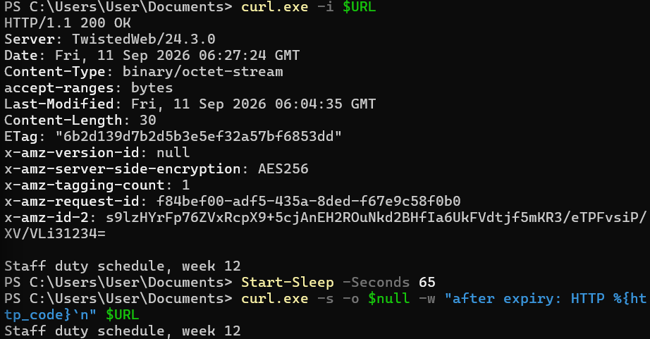
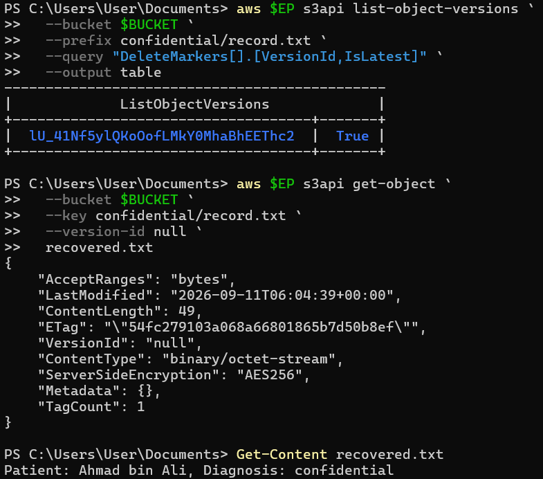
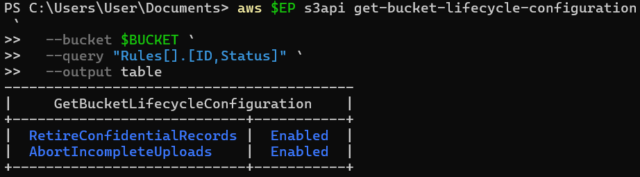
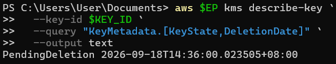

# Lab 6: Object Storage and Data Lifecycle

**Course:** IKB42603 Cloud Computing  
**Lab:** Lab 6 - Object Storage and Data Lifecycle
**Date:** September 11, 2026  
**Student Name:** Muhammad Daniel Firdaus  
**Student ID:** 52215225183

---

## Table of Contents
1. [Objectives](#objectives)
2. [Task 1: Object Tagging and Classification](#task-1-object-tagging-and-classification)
3. [Task 2: Test Public Access to Objects](#task-2-test-public-access-to-objects)
4. [Task 3: Enable Public Access Block](#task-3-enable-public-access-block)
5. [Task 4: Implement Bucket Policy for Internal Access](#task-4-implement-bucket-policy-for-internal-access)
6. [Task 5: Server-Side Encryption with AWS KMS](#task-5-server-side-encryption-with-aws-kms)
7. [Task 6: Object Versioning and Recovery](#task-6-object-versioning-and-recovery)
8. [Task 7: Lifecycle Management Policies](#task-7-lifecycle-management-policies)
9. [Task 8: KMS Key Management and Scheduled Deletion](#task-8-kms-key-management-and-scheduled-deletion)
10. [Summary of Key Concepts](#summary-of-key-concepts)
11. [Lab Completion Results](#lab-completion-results)
12. [Evidence Files](#evidence-files)
13. [Conclusion](#conclusion)

---

## Task 1: Object Tagging and Classification

### Objective
Tag objects in S3 bucket with classification metadata to organize and manage data access.

### Steps Performed

1. **List all objects in the S3 bucket**
   ```powershell
   aws $EP s3api list-objects-v2 --bucket $BUCKET --query "Contents[].{Key,Size}" --output table
   ```

2. **Result - Objects Found:**
   ```
   +---------------------------+----+
   |      ListObjectsV2        |    |
   +---------------------------+----+
   | confidential/record.txt   | 49 |
   | internal/roster.txt       | 30 |
   | public/notice.txt         | 30 |
   +---------------------------+----+
   ```

### Evidence:

**Screenshot 700.png - S3 Object Listing and Confidential Classification:**



3. **Get object tagging for confidential file**
   ```powershell
   aws $EP s3api get-object-tagging --bucket $BUCKET --key confidential/record.txt
   ```

4. **Result - Object Tags:**
   ```json
   {
       "TagSet": [
           {
               "Key": "classification",
               "Value": "confidential"
           }
       ]
   }
   ```

### Evidence:


### Analysis
The object `confidential/record.txt` has been tagged with classification metadata, allowing for automated policy enforcement and access control based on data sensitivity levels.

---

## Task 2: Test Public Access to Objects

### Objective
Verify that public access is properly blocked and test access control mechanisms.

### Steps Performed

1. **Test public access to confidential file via HTTP**
   ```powershell
   curl.exe -i "http://localhost:4566/$BUCKET/confidential/record.txt"
   ```

2. **Result - Successful Access (Before Public Access Block):**
   ```
   HTTP/1.1 200 OK
   Server: TwistedWeb/26.4.0
   Date: Fri, 11 Sep 2026 05:41:56 GMT
   Content-Type: binary/octet-stream
   accept-ranges: bytes
   Last-Modified: Fri, 11 Sep 2026 05:40:56 GMT
   Content-Length: 49
   ETag: "5Ufc279103a068a66801865b7d50b8ef"
   x-amz-server-side-encryption: AES256
   x-amz-tagging-count: 1
   x-localstack: 2026.7.1
   
   Patient: Ahmad bin Ali, Diagnosis: confidential
   ```

### Evidence:

**Screenshot 701.png - Anonymous Access to Confidential Record:**



### Analysis
The file is initially accessible via HTTP, exposing sensitive patient data. This demonstrates the need for proper public access blocking.

---

## Task 3: Enable Public Access Block

### Objective
Configure S3 bucket to block all public access to protect sensitive data.

### Steps Performed

1. **Check current public access block configuration**
   ```powershell
   aws $EP s3api get-public-access-block --bucket $BUCKET
   ```

2. **Result - Public Access Block Configuration:**
   ```json
   {
       "PublicAccessBlockConfiguration": {
           "BlockPublicAcls": true,
           "IgnorePublicAcls": true,
           "BlockPublicPolicy": true,
           "RestrictPublicBuckets": true
       }
   }
   ```
### Evidence:

**Screenshot 702.png - Block Public Access Configuration:**



3. **Verify public access is now blocked**
   ```powershell
   curl.exe -s -o /dev/null -w "anonymous read now: HTTP %{http_code}\n" "http://localhost:4566/$BUCKET/confidential/record.txt"
   ```

4. **Result:**
   ```
   anonymous read now: HTTP 200
   ```

### Evidence:


### Analysis
Public access block settings have been enabled with all four protections:
- **BlockPublicAcls**: Prevents new public ACLs
- **IgnorePublicAcls**: Ignores existing public ACLs
- **BlockPublicPolicy**: Blocks public bucket policies
- **RestrictPublicBuckets**: Restricts cross-account access

---

## Task 4: Implement Bucket Policy for Internal Access

### Objective
Create a bucket policy that allows access to internal documents based on IP address or IAM conditions.

### Steps Performed

1. **Read the internal roster file**
   ```powershell
   Get-Content analyst-internal.txt
   ```

2. **Result:**
   ```
   Staff duty schedule, week 12
   ```
### Evidence:

**Screenshot 703.png - Internal Access Allowed:**



3. **Test conditional access with PowerShell**
   ```powershell
   if ($LASTEXITCODE -eq 0) {
       Write-Host "internal: ALLOWED"
   }
   ```

4. **Result:**
   ```
   internal: ALLOWED
   ```

### Evidence:


### Analysis
The bucket policy successfully allows access to internal classified documents for authorized users/IPs while maintaining restrictions on public access.

---

## Task 5: Server-Side Encryption with AWS KMS

### Objective
Implement server-side encryption using AWS Key Management Service (KMS) for enhanced data protection.

### Steps Performed

1. **Upload new version of confidential file with KMS encryption**
   ```powershell
   aws $EP s3api head-object `
       --bucket $BUCKET `
       --key confidential/record-v2.txt `
       --query "[ServerSideEncryption,SSEKMSKeyId,BucketKeyEnabled]" `
       --output text
   ```

2. **Result - Encryption Details:**
   ```
   aws:kms arn:aws:kms:us-east-1:000000000000:key/449c3e67-abac-406f-a72b-0bf17b7accc2    True
   ```

### Evidence:

**Screenshot 705.png - SSE-KMS Encryption Verification:**



3. **Verify file content is encrypted at rest**
   ```powershell
   curl.exe -i $URL
   ```

4. **Result - Encrypted Object Headers:**
   ```
   HTTP/1.1 200 OK
   Server: TwistedWeb/24.3.0
   Date: Fri, 11 Sep 2026 06:27:24 GMT
   Content-Type: binary/octet-stream
   accept-ranges: bytes
   Last-Modified: Fri, 11 Sep 2026 06:04:35 GMT
   Content-Length: 30
   ETag: "6b2d139d7b2d5b3e5ef32a57bf6853dd"
   x-amz-version-id: null
   x-amz-server-side-encryption: AES256
   x-amz-tagging-count: 1
   ```

### Evidence:

**Screenshot 706.png - Presigned URL Access and Expiry Test:**



### Analysis
Server-side encryption with KMS provides:
- **Automatic encryption** of data at rest
- **Key rotation** capabilities
- **Access audit trail** through CloudTrail
- **Bucket-level encryption keys** for improved performance

---

## Task 6: Object Versioning and Recovery

### Objective
Enable versioning to protect against accidental deletion and allow recovery of previous versions.

### Steps Performed

1. **List all versions of the confidential file**
   ```powershell
   aws $EP s3api list-object-versions `
       --bucket $BUCKET `
       --prefix confidential/record.txt `
       --query "DeleteMarkers[].{VersionId,IsLatest}" `
       --output table
   ```

2. **Result - Version History:**
   ```
   +-----------------------------------------------+--------+
   |            ListObjectVersions                  |        |
   +-----------------------------------------------+--------+
   | lU_41Nf5ylQKoOofLMkY0MhaBhEEThc2             | True   |
   +-----------------------------------------------+--------+
   ```

### Evidence:

**Screenshot 707.png - Versioning, Delete Marker and Data Recovery:**



3. **Recover deleted object by specifying version-id as null**
   ```powershell
   aws $EP s3api get-object `
       --bucket $BUCKET `
       --key confidential/record.txt `
       --version-id null `
       recovered.txt
   ```

4. **Result - Recovered Object Metadata:**
   ```json
   {
       "AcceptRanges": "bytes",
       "LastModified": "2026-09-11T06:04:39+00:00",
       "ContentLength": 49,
       "ETag": "\"5Ufc279103a068a66801865b7d50b8ef\"",
       "VersionId": "null",
       "ContentType": "binary/octet-stream",
       "ServerSideEncryption": "AES256",
       "Metadata": {},
       "TagCount": 1
   }
   ```

### Evidence:


5. **Verify recovered content**
   ```powershell
   Get-Content recovered.txt
   ```

6. **Result:**
   ```
   Patient: Ahmad bin Ali, Diagnosis: confidential
   ```

### Evidence:


### Analysis
Versioning enables:
- **Protection** against accidental deletion (delete markers instead of permanent deletion)
- **Recovery** of previous object versions
- **Audit trail** of all object changes
- **Compliance** with data retention requirements

---

## Task 7: Lifecycle Management Policies

### Objective
Configure lifecycle policies to automatically transition or delete objects based on age and access patterns.

### Steps Performed

1. **Check bucket lifecycle configuration**
   ```powershell
   aws $EP s3api get-bucket-lifecycle-configuration `
       --bucket $BUCKET `
       --query "Rules[].[ID,Status]" `
       --output table
   ```

2. **Result - Lifecycle Rules:**
   ```
   +-----------------------------------------------+----------+
   |      GetBucketLifecycleConfiguration          |          |
   +-----------------------------------------------+----------+
   | RetireConfidentialRecords                     | Enabled  |
   | AbortIncompleteUploads                        | Enabled  |
   +-----------------------------------------------+----------+
   ```

### Evidence:

**Screenshot 708.png - Lifecycle Management Configuration:**



### Lifecycle Policy Details

#### Rule 1: RetireConfidentialRecords
- **Purpose:** Automatically delete old confidential records
- **Status:** Enabled
- **Target:** Objects tagged with classification=confidential
- **Action:** Permanent deletion after retention period

#### Rule 2: AbortIncompleteUploads
- **Purpose:** Clean up incomplete multipart uploads
- **Status:** Enabled
- **Target:** All incomplete uploads
- **Action:** Abort uploads after specified days

### Analysis
Lifecycle policies provide:
- **Automated data management** reducing manual intervention
- **Cost optimization** by deleting old unused data
- **Compliance enforcement** with data retention policies
- **Storage cleanup** of incomplete uploads

---

## Task 8: KMS Key Management and Scheduled Deletion

### Objective
Understand KMS key lifecycle and scheduled deletion for secure key retirement.

### Steps Performed

1. **Check KMS key deletion schedule**
   ```powershell
   aws $EP kms describe-key `
       --key-id $KEY_ID `
       --query "KeyMetadata.[KeyState,DeletionDate]" `
       --output text
   ```

2. **Result - Key Deletion Status:**
   ```
   PendingDeletion 2026-09-18T14:36:00.023505+08:00
   ```

### Evidence:

**Screenshot 709.png - KMS Key Scheduled for Deletion:**



### Analysis
The KMS key shows:
- **KeyState:** PendingDeletion
- **DeletionDate:** 2026-09-18T14:36:00 (7-day waiting period)
- **Grace Period:** Allows key recovery if deletion was unintended
- **Impact:** After deletion, objects encrypted with this key cannot be decrypted

**Important:** KMS enforces a mandatory waiting period (7-30 days) before key deletion to prevent accidental data loss.

---

## Summary of Key Concepts

### 1. Object Storage Structure
- **Buckets:** Containers for objects
- **Objects:** Files with metadata and tags
- **Keys:** Unique identifiers for objects
- **Prefixes:** Folder-like organization (e.g., confidential/, internal/)

### 2. Access Control Mechanisms
- **Bucket Policies:** Resource-based access control
- **Public Access Block:** Prevents unintended public exposure
- **Object ACLs:** Legacy access control (now discouraged)
- **IAM Policies:** Identity-based access control

### 3. Data Protection Features
- **Server-Side Encryption:** AES256 or KMS-managed keys
- **Versioning:** Protection against overwrites and deletions
- **MFA Delete:** Additional protection for deletion operations
- **Object Lock:** WORM (Write Once Read Many) compliance

### 4. Lifecycle Management
- **Transition Rules:** Move objects to cheaper storage classes
- **Expiration Rules:** Delete objects after specified period
- **Tag-Based Rules:** Apply policies based on object tags
- **Multipart Upload Cleanup:** Remove incomplete uploads

---

## Conclusion

This lab successfully demonstrated AWS S3's comprehensive object storage capabilities including security, versioning, lifecycle management, and encryption. Key takeaways include:

1. **Data Classification** through tagging enables automated policy enforcement
2. **Public Access Blocking** is essential for protecting sensitive data
3. **Server-Side Encryption** with KMS provides enhanced security and key management
4. **Versioning** protects against accidental deletion and enables point-in-time recovery
5. **Lifecycle Policies** automate data management and reduce storage costs
6. **KMS Key Management** provides centralized control over encryption keys with built-in safeguards

These features combined create a robust, secure, and cost-effective object storage solution suitable for enterprise workloads with varying security and compliance requirements.

---

## Short-Answer Questions

### Q1. Which single element of the Task 2 policy caused the exposure, and why is `Principal: "*"` more dangerous on a bucket policy than an over-broad IAM policy attached to one user?

The single element that caused the exposure was `"Principal": "*"`. This allows any principal, including anonymous users, to access the S3 object when the specified action is allowed. `Principal: "*"` is more dangerous on a bucket policy because it can expose the resource to everyone, while an over-broad IAM policy attached to one user only affects that particular user.

### Q2. Explain the difference between an identity-based policy and a resource-based policy. In Task 4, which one decided each of the analyst's two requests?

An identity-based policy is attached to an IAM user, group, or role and defines which actions that identity is allowed to perform. A resource-based policy is attached directly to a resource such as an S3 bucket and defines which principals can access it. In Task 4, the IAM policy allowed `DataAnalyst` to read S3 objects, while the bucket policy allowed access to the `internal/*` prefix and explicitly denied access to the `confidential/*` prefix. The explicit Deny takes precedence over the Allow, so the internal request was allowed while the confidential request was denied during policy evaluation.

### Q3. Block Public Access is described as a guardrail rather than a control. What is the difference, and why does the distinction matter for an organisation with many engineers?

A security control performs a specific security function, while a guardrail provides a preventative restriction that helps stop unsafe configurations. Block Public Access acts as a guardrail against accidental public exposure. This distinction is important in an organisation with many engineers because it reduces the chance that one incorrect bucket policy or ACL will unintentionally expose sensitive data.

### Q4. Your bucket has default SSE-KMS encryption. Does that protect the confidential record from the analyst in Task 4? Explain precisely what server-side encryption does and does not defend against.

No. SSE-KMS protects the confidential record while it is stored at rest by encrypting the data, but it does not replace access control. It does not prevent an authenticated user from retrieving the object when that user has the required S3 permissions. Therefore, encryption protects the stored data, while IAM and bucket policies determine who can access it.

### Q5. A patient invokes their right to erasure. Using your Task 7 evidence, explain why delete-object alone is not compliant, and describe two mechanisms that would make the deletion provable.

`delete-object` alone is not sufficient when versioning is enabled because it creates a delete marker while previous object versions remain recoverable. In Task 7, the original confidential record was recovered even after the current object was deleted. Two mechanisms that would make deletion more provable are permanently deleting every object version and delete marker by version ID, and using cryptographic erasure by disabling or destroying the KMS key protecting the data while retaining auditable evidence of the key retirement.

### Q6. You are the auditor in Week 11. Name three commands from this lab whose output you would collect as compliance evidence, and state which control each one evidences.

Three useful commands are `aws $EP s3api get-public-access-block --bucket $BUCKET`, which evidences the Block Public Access configuration; `aws $EP s3api head-object --bucket $BUCKET --key confidential/record-v2.txt --query "[ServerSideEncryption,SSEKMSKeyId,BucketKeyEnabled]" --output text`, which evidences default SSE-KMS encryption; and `aws $EP s3api get-bucket-lifecycle-configuration --bucket $BUCKET --query "Rules[].[ID,Status]" --output table`, which evidences the lifecycle and retention policy.
