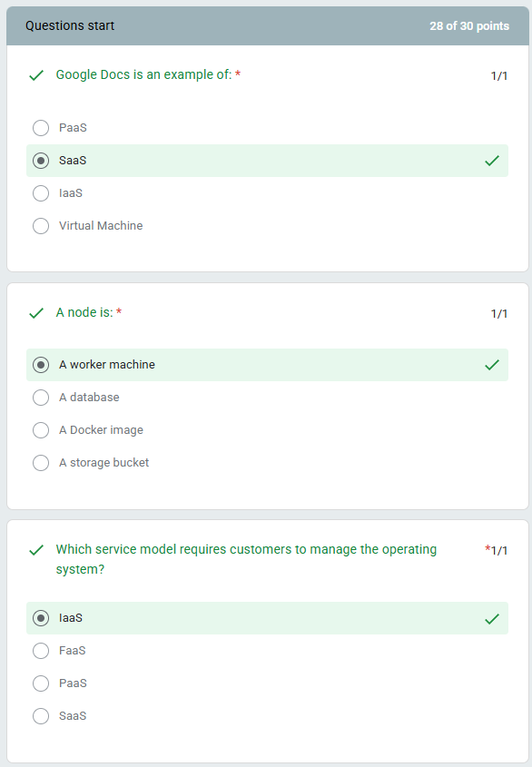
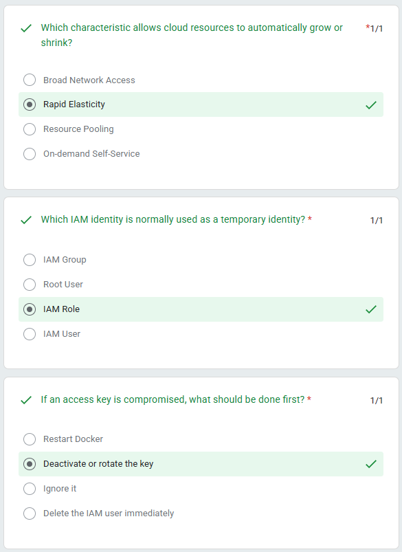
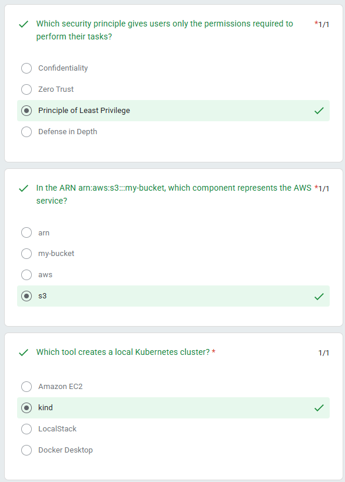
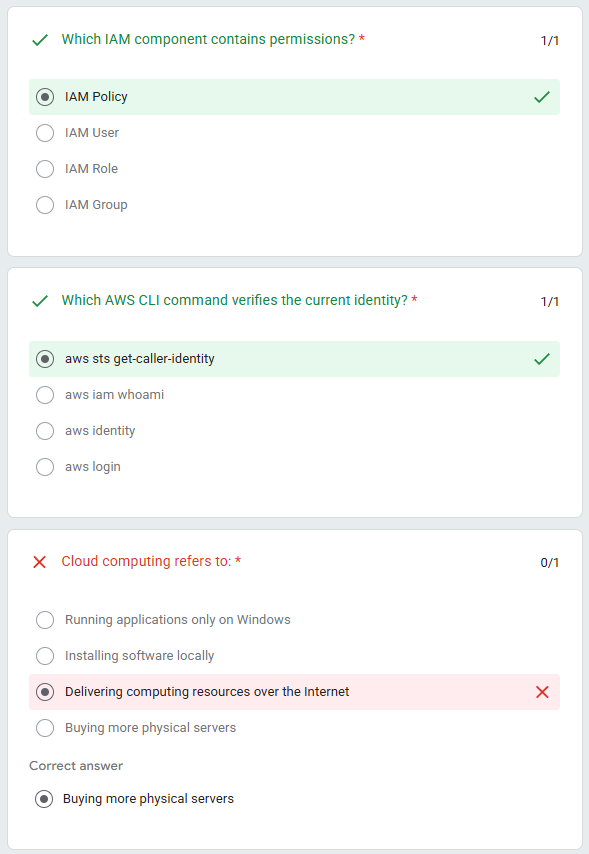
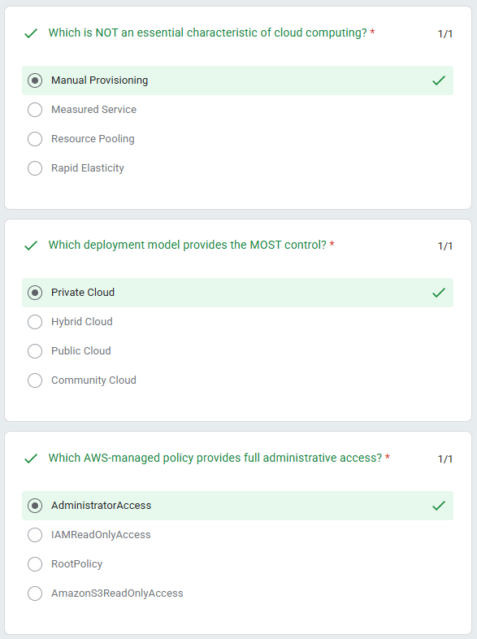
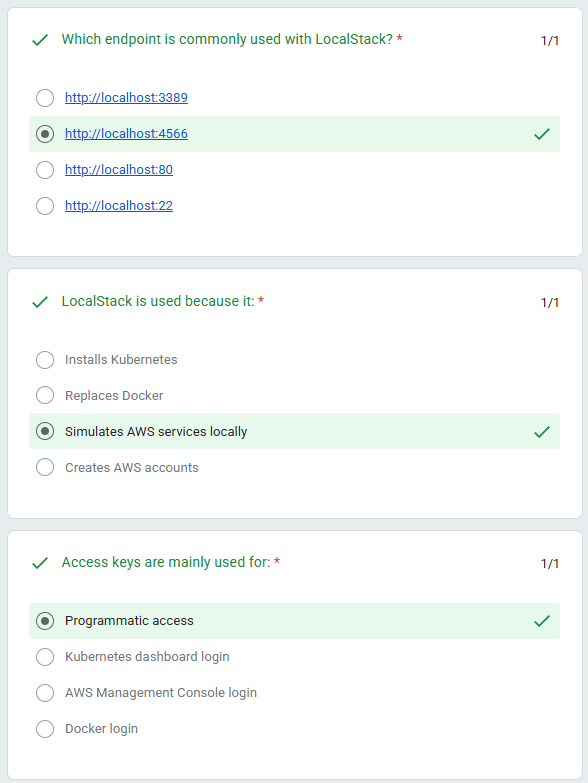
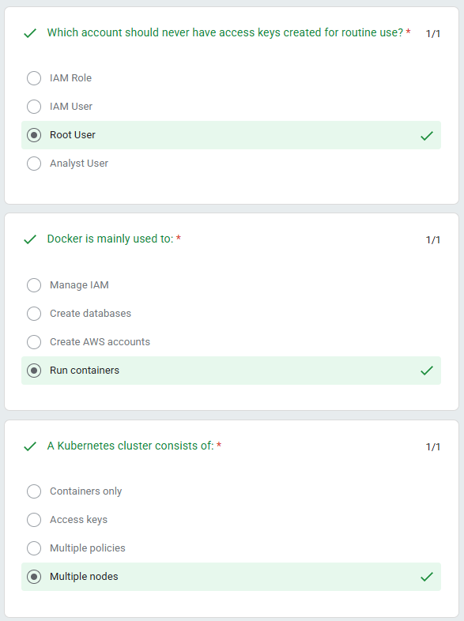
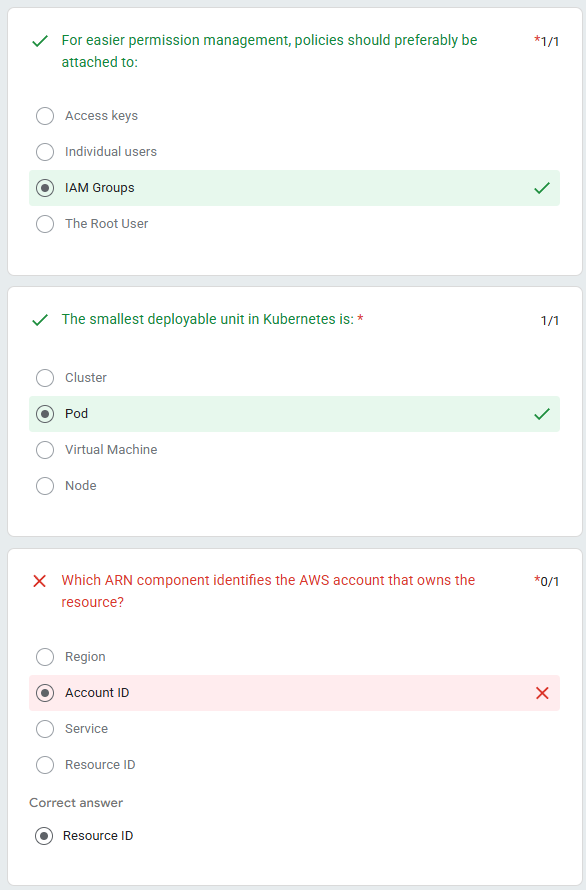
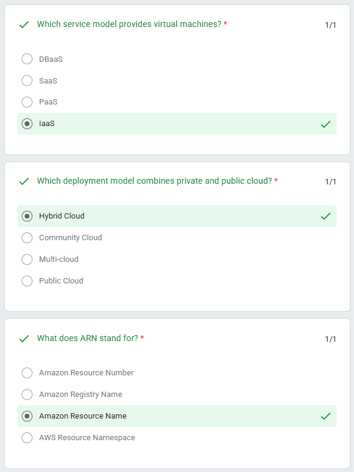
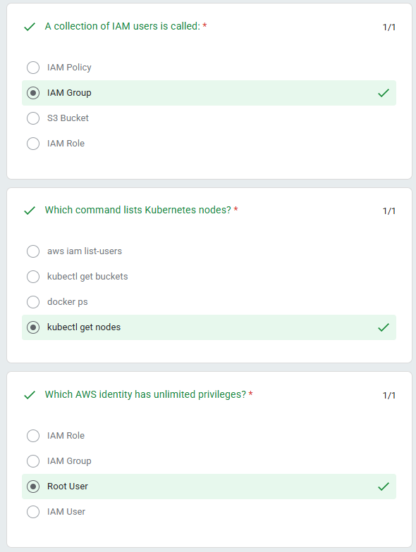

# Quiz 1 - Week 2: Cloud Computing

**Score: 28 of 30 points (93.3%)**

---

## Question 1
**Google Docs is an example of:** ✓

- [ ] PaaS
- [x] **SaaS** ✓
- [ ] IaaS
- [ ] Virtual Machine

**Status:** Correct (1/1)

---

## Question 2
**A node is:** ✓

- [x] **A worker machine** ✓
- [ ] A database
- [ ] A Docker image
- [ ] A storage bucket

**Status:** Correct (1/1)

---

## Question 3
**Which service model requires customers to manage the operating system?** ✓

- [x] **IaaS** ✓
- [ ] FaaS
- [ ] PaaS
- [ ] SaaS

**Status:** Correct (1/1)

---

## Question 4
**Which characteristic allows cloud resources to automatically grow or shrink?** ✓

- [ ] Broad Network Access
- [x] **Rapid Elasticity** ✓
- [ ] Resource Pooling
- [ ] On-demand Self-Service

**Status:** Correct (1/1)

---

## Question 5
**Which IAM identity is normally used as a temporary identity?** ✓

- [ ] IAM Group
- [ ] Root User
- [x] **IAM Role** ✓
- [ ] IAM User

**Status:** Correct (1/1)

---

## Question 6
**If an access key is compromised, what should be done first?** ✓

- [ ] Restart Docker
- [x] **Deactivate or rotate the key** ✓
- [ ] Ignore it
- [ ] Delete the IAM user immediately

**Status:** Correct (1/1)

---

## Question 7
**Which security principle gives users only the permissions required to perform their tasks?** ✓

- [ ] Confidentiality
- [ ] Zero Trust
- [x] **Principle of Least Privilege** ✓
- [ ] Defense in Depth

**Status:** Correct (1/1)

---

## Question 8
**In the ARN arn:aws:s3:::my-bucket, which component represents the AWS service?** ✓

- [ ] arn
- [ ] my-bucket
- [ ] aws
- [x] **s3** ✓

**Status:** Correct (1/1)

---

## Question 9
**Which tool creates a local Kubernetes cluster?** ✓

- [ ] Amazon EC2
- [x] **kind** ✓
- [ ] LocalStack
- [ ] Docker Desktop

**Status:** Correct (1/1)

---

## Question 10
**Which IAM component contains permissions?** ✓

- [x] **IAM Policy** ✓
- [ ] IAM User
- [ ] IAM Role
- [ ] IAM Group

**Status:** Correct (1/1)

---

## Question 11
**Which AWS CLI command verifies the current identity?** ✓

- [x] **aws sts get-caller-identity** ✓
- [ ] aws iam whoami
- [ ] aws identity
- [ ] aws login

**Status:** Correct (1/1)

---

## Question 12
**Cloud computing refers to:** ✗

- [ ] Running applications only on Windows
- [ ] Installing software locally
- [x] ~~Delivering computing resources over the Internet~~ ✗
- [ ] Buying more physical servers

**Correct answer:** Buying more physical servers

**Status:** Incorrect (0/1)

---

## Question 13
**Which is NOT an essential characteristic of cloud computing?** ✓

- [x] **Manual Provisioning** ✓
- [ ] Measured Service
- [ ] Resource Pooling
- [ ] Rapid Elasticity

**Status:** Correct (1/1)

---

## Question 14
**Which deployment model provides the MOST control?** ✓

- [x] **Private Cloud** ✓
- [ ] Hybrid Cloud
- [ ] Public Cloud
- [ ] Community Cloud

**Status:** Correct (1/1)

---

## Question 15
**Which AWS-managed policy provides full administrative access?** ✓

- [x] **AdministratorAccess** ✓
- [ ] IAMReadOnlyAccess
- [ ] RootPolicy
- [ ] AmazonS3ReadOnlyAccess

**Status:** Correct (1/1)

---

## Question 16
**Which endpoint is commonly used with LocalStack?** ✓

- [ ] http://localhost:3389
- [x] **http://localhost:4566** ✓
- [ ] http://localhost:80
- [ ] http://localhost:22

**Status:** Correct (1/1)

---

## Question 17
**LocalStack is used because it:** ✓

- [ ] Installs Kubernetes
- [ ] Replaces Docker
- [x] **Simulates AWS services locally** ✓
- [ ] Creates AWS accounts

**Status:** Correct (1/1)

---

## Question 18
**Access keys are mainly used for:** ✓

- [x] **Programmatic access** ✓
- [ ] Kubernetes dashboard login
- [ ] AWS Management Console login
- [ ] Docker login

**Status:** Correct (1/1)

---

## Question 19
**Which account should never have access keys created for routine use?** ✓

- [ ] IAM Role
- [ ] IAM User
- [x] **Root User** ✓
- [ ] Analyst User

**Status:** Correct (1/1)

---

## Question 20
**Docker is mainly used to:** ✓

- [ ] Manage IAM
- [ ] Create databases
- [ ] Create AWS accounts
- [x] **Run containers** ✓

**Status:** Correct (1/1)

---

## Question 21
**A Kubernetes cluster consists of:** ✓

- [ ] Containers only
- [ ] Access keys
- [ ] Multiple policies
- [x] **Multiple nodes** ✓

**Status:** Correct (1/1)

---

## Question 22
**For easier permission management, policies should preferably be attached to:** ✓

- [ ] Access keys
- [ ] Individual users
- [x] **IAM Groups** ✓
- [ ] The Root User

**Status:** Correct (1/1)

---

## Question 23
**The smallest deployable unit in Kubernetes is:** ✓

- [ ] Cluster
- [x] **Pod** ✓
- [ ] Virtual Machine
- [ ] Node

**Status:** Correct (1/1)

---

## Question 24
**Which ARN component identifies the AWS account that owns the resource?** ✗

- [ ] Region
- [x] ~~Account ID~~ ✗
- [ ] Service
- [ ] Resource ID

**Correct answer:** Resource ID

**Status:** Incorrect (0/1)

---

## Question 25
**Which service model provides virtual machines?** ✓

- [ ] DBaaS
- [ ] SaaS
- [ ] PaaS
- [x] **IaaS** ✓

**Status:** Correct (1/1)

---

## Question 26
**Which deployment model combines private and public cloud?** ✓

- [x] **Hybrid Cloud** ✓
- [ ] Community Cloud
- [ ] Multi-cloud
- [ ] Public Cloud

**Status:** Correct (1/1)

---

## Question 27
**What does ARN stand for?** ✓

- [ ] Amazon Resource Number
- [ ] Amazon Registry Name
- [x] **Amazon Resource Name** ✓
- [ ] AWS Resource Namespace

**Status:** Correct (1/1)

---

## Question 28
**A collection of IAM users is called:** ✓

- [ ] IAM Policy
- [x] **IAM Group** ✓
- [ ] S3 Bucket
- [ ] IAM Role

**Status:** Correct (1/1)

---

## Question 29
**Which command lists Kubernetes nodes?** ✓

- [ ] aws iam list-users
- [ ] kubectl get buckets
- [ ] docker ps
- [x] **kubectl get nodes** ✓

**Status:** Correct (1/1)

---

## Question 30
**Which AWS identity has unlimited privileges?** ✓

- [ ] IAM Role
- [ ] IAM Group
- [x] **Root User** ✓
- [ ] IAM User

**Status:** Correct (1/1)

---

## Summary

### Score Breakdown
- **Total Points:** 28/30 (93.3%)
- **Correct Answers:** 28
- **Incorrect Answers:** 2

### Incorrect Questions
1. **Question 12:** Cloud computing refers to
   - Selected: Delivering computing resources over the Internet
   - Correct: Buying more physical servers
   
2. **Question 24:** Which ARN component identifies the AWS account that owns the resource?
   - Selected: Account ID
   - Correct: Resource ID

### Topics Covered
- Cloud Service Models (IaaS, PaaS, SaaS)
- Cloud Deployment Models (Public, Private, Hybrid)
- Cloud Characteristics (Elasticity, Resource Pooling, etc.)
- AWS IAM (Users, Roles, Groups, Policies)
- Security Best Practices (Least Privilege, Access Keys)
- AWS ARN Structure
- Kubernetes Basics (Nodes, Pods, Clusters)
- Docker Containers
- LocalStack for AWS Simulation
- AWS CLI Commands
